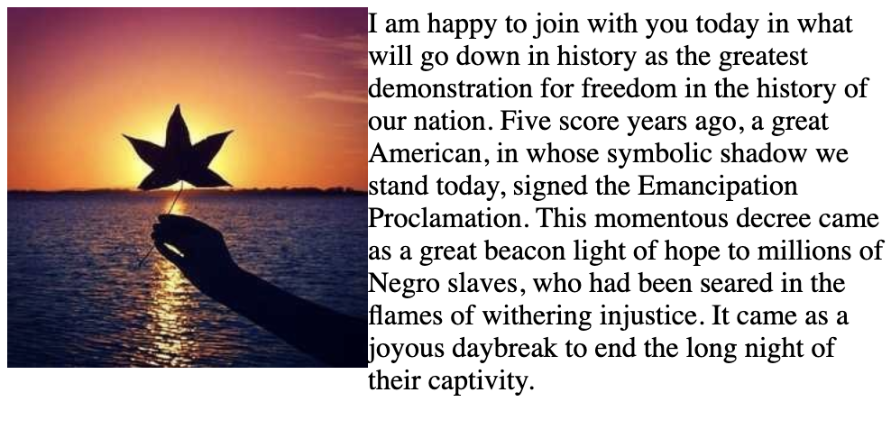
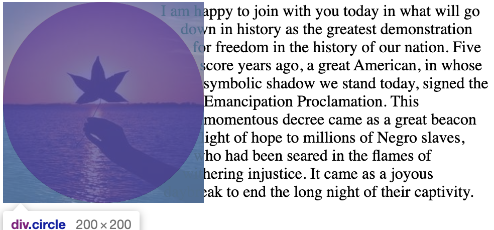
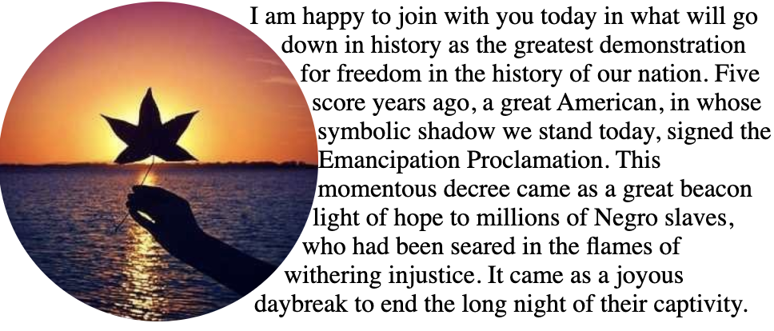
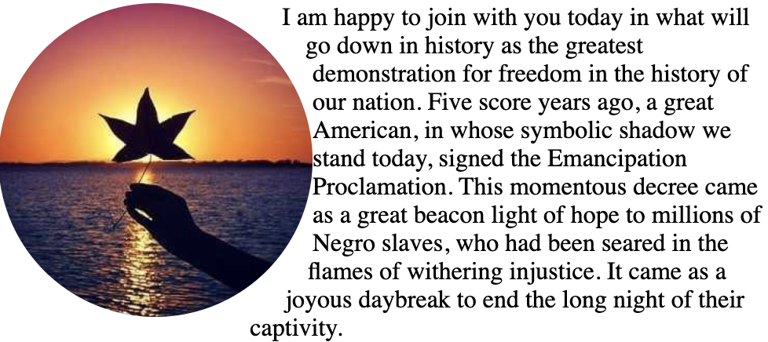

# CSS Shapes
在 css shapes 出来之前，网页都是由一个个元素横平竖直的堆起来的，像报刊杂志中经常出来的文字环绕图像的效果是无法在直接在网页中实现的。



```html
<div></div>
I am happy to join with you today in what will go down in history as the greatest demonstration for freedom in the history of our nation.
Five score years ago, a great American, in whose symbolic shadow we stand today, signed the Emancipation Proclamation. This momentous decree came as a great beacon light of hope to millions of Negro slaves, who had been seared in the flames of withering injustice. It came as a joyous daybreak to end the long night of their captivity.
```

即使给div加上 `border-radius` 属性使其变圆，也无法改变其边界是一条竖线这个特征。

CSS Shapes 的出现使这一切变得可能，对 div 应用以下样式

```css
height: 200px;
width: 200px;
float: left;
shape-outside: circle(100px at 100px 100px);
background-image: url("./shape-1.jpg");
background-size: contain;
```



可以看到右侧的文字已经顺着 div 中间的圆形进行圆形环绕，只是圆形四周的背景图仍然能看得见，此时可以添加 `clip-path` 属性裁切圆形以外的部分

```css
clip-path: circle(100px at 100px 100px);
```



如果觉得文字和图片之前太近，还可以添加 `shape-margin` 属性，比如

```css
shape-margin: 15px;
```



可以看到上下已经和图片有一段距离了，只是 `shape-margin` 最远不会超出 div 的边界，所以中间部分的文字和圆的距离并没有改变，因为这些文本原本就在 div 以外，不会受 `shape-margin` 的影响。


实现这样的效果最重要的当然是 `shape-outside` 属性，用来定义边界形状，它的取值大致分为以下这么几种

```css
/* 关键字值 */
shape-outside: none; /* 没有影响，默认行为围绕 */
shape-outside: margin-box; /* 围绕在 margin 边界 */
shape-outside: border-box; /* 越过 margin 区域，围绕在 border 边界 */
shape-outside: padding-box; /* 越过 border 区域，围绕在 padding 边界 */
shape-outside: content-box; /* 越过 padding 区域，围绕在 content 边界 */
```

还有 `inset, circle, ellipse, polygon` 四种函数可以用来定义，矩形，圆形，椭圆，和多边形

如果是要实现圆形环绕，最简单的方法当然是使用 `border-radius` 和一个非 `none` 的 `shape-outside` 结合

还有就是可以通过 `url` 函数去加载一张图片，通过图片的透明度来标记边缘。

```css
width: 300px;
height: 451px;
float: left;
background-image: url(./shape-5.png);
shape-outside: url(./shape-5.png);
-webkit-mask: url(./shape-5.png) no-repeat;
mask: url(./shape-5.png) no-repeat;
```


当然也可以用 `linear-gradient` 和 `radial-gradient` 生成线性渐变和径向渐变，透明的边界进行环绕

在使用透明度进行环绕的时候，支持使用  `shape-image-threshold` 来指定透明度的边界，默认是全透明的地方

