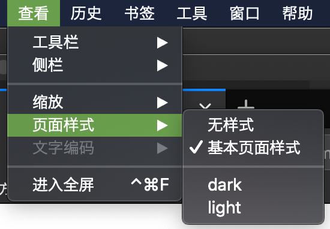

# link

link 标签一般是用来关联一个样式文件的，它支持 title 属性，一般是结合 `rel="alternate"` 一起使用的

```html
<link rel="stylesheet" href="./base.css">
<link rel="alternate stylesheet" title="dark" href="./dark.css">
<link rel="alternate stylesheet" title="light" href="./light.css">
```

对于这样一段代码，页面加载后，只会有第一个 `base.css` 文件生效，其它两个因为 `rel` 属性存在 `alternate` 值，从而成为待选项。

在 `Firefox` 浏览器中有如下菜单可供选择备用样式


可以看到，`页面样式`菜单下有四个选项，

- 无样式会禁用所有样式
- 基本页面样式会只应用没有 `title` 属性的样式表
- 下面的则是根据 `title` 值去选择，多个同 `title` 值的 `link` 是合在一个菜单选择的

chrome（可安装插件[Alt CSS](https://chrome.google.com/webstore/detail/alt-css/deaodobjfcolfhkecnnghdclnlmfjdje)）, safari 浏览器暂未见相关菜单
