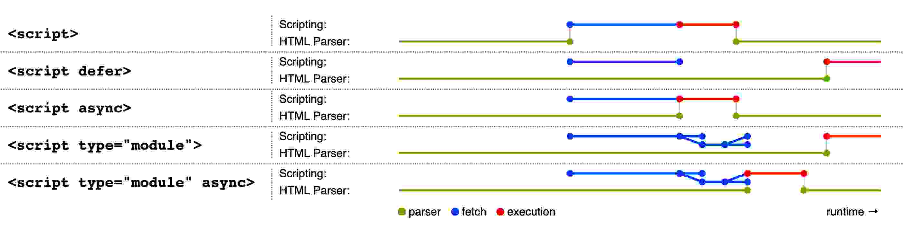

# script标签

脚本可以让用户向文档添加交互，一般建议用户尽可能声明元素来替找脚本，因为有些用户会禁止脚本功能。写代码时也应该尽可能在不支持脚本的时候应用能够完全降级使用。

script标签除了全局属性，还支持`src`, `type`, `nomodule`, `async`, `defer`, `crossorigin`, `text`, `integrity`, `referrerpolicy`


`type`属性用来定义script标签代表的类型
- 不设置，设置为空字符串，或者设置为[JavaScript MIME type](https://mimesniff.spec.whatwg.org/#javascript-mime-type-essence-match)，表示这是个经典脚本，经典脚本在`src`属性没有设置的时候，会受到`async`和`defer`属性的影响，用户应该忽略这个属性，而不是作不必要的设置
- 设置为字符串`module`(大小写不敏感)表示这是一个模块化脚本，这样的标签不受`defer`属性影响，但是受`async`属性影响(不论有没有设置src属性)
- 设置为其他值表示这是个数据块，不会被js引擎作为脚本执行，其他属性不会影响这个script标签

经典脚本和模块化脚本可以内联嵌入或者使用src属性来从外部文件导入。当script标签用来包含数据块，则必须是内联引入，数据的格式需要用`type`属性来指明，标签内容也是需要匹配数据格式。不要设置`src`, `async`, `nomodule`, `defer`, `crossorigin`, `integrity`, `referrerpolicy`等属性。


`nomodule`属性是一个布尔值，可以用来阻止支持模块脚本的客户端执行这个脚本，这允许用户选择在现代客户端执行模块化脚本，在老的客户端执行经典脚本。不可以在模块化脚本上声明`nomodule`属性，即使声明了也会被忽略。


`async`和`defer`属性是布尔属性，用来指明脚本被如何执行。经典脚本可以声明`defer`或者`async`属性，但必须要存在`src`属性才有效果。模块脚本可以声明`async`属性，但不可以设置`defer`属性


对于经典脚本，如果声明了`async`属性，那么脚本会被并行下载(不阻塞文档解析)并在下载完成后尽快执行(可能会在文档解析完成之前)。如果没有`async`但是声明了`defer`属性，那么脚本会被并行下载在页面完成解析之后执行。如果都没有，那么脚本会阻塞页面的解析，在脚本下载并执行完成后再继续文档解析


对于模块脚本，如果声明了`async`属性，那么脚本及其所有依赖都会被并行下载，并且尽快执行。如果没有`async`属性，脚本及其依赖会被并行下载，但是要在文档解析完成后执行。

可以参照下图



`defer`和`async`属性可以同时声明，可以让一些不支持async但是支持defer属性的的浏览器降级到defer行为，从而不阻塞页面解析。


`crossorigin`是一个[CORS设置属性](https://html.spec.whatwg.org/multipage/urls-and-fetching.html#cors-settings-attribute)，对于经典脚本可以控制跨域脚本中错误信息是否暴露，对于模块脚本，用来控制跨域请求的凭证模式。

- 默认情况下不设置些属性，如果资源文件是跨域的，那么在window.onerror全局监听浏览器脚本错误的时候，拿不到详细的错误信息，下载文件的请求会带上cookie
> ["Script error.", "", 0, 0, null]
- 设置为`anonymous`或者空字符串，cors请求资源，credentials mode会被设为`same-origin`，此时下载跨域资源的请求不会携带cookie信息，但是错误信息却是完整的
> ["Uncaught ReferenceError: a is not defined", "http://192.168.3.11:8000/test/script.js", 1, 13, ReferenceError: a is not defined at http://192.168.3.11:8000/test/script.js:1:13]
- 设置为`use-credentials`，cors请求资源，credentials mode会被设置为`include`, 此时下载跨域资源请求会携带cookie信息，错误信息也是完整的，但是服务端响应的时候`Access-Control-Allow-Origin`不能简单的设置为`*`
> The value of the 'Access-Control-Allow-Origin' header in the response must not be the wildcard '*' when the request's credentials mode is 'include'.

`integrity`属性代表数据完整性，内容是文本，没声明`src`属性是不要设置此属性。

这是用来校验资源文件的完整性的，可以在资源文件被篡改的时候阻止脚本执行
```html
<script src="resource/url" integrity="sha384-F7YkPfzYvld+Xlykp/W6EUgd1svC1OBKolN7i8KzHwUDx/3LE5fc0qa/F6R1ONhW"></script>
```
签名生成的算法目前支持`sha256`, `sha384`, `sha512`算法，生成命令如下
```shell
$ cat FILENAME.js | openssl dgst -sha384 -binary | openssl enc -base64 -A
# 或者
$ shasum -b -a 384 FILENAME.js | xxd -r -p | base64
```
用来防止cdn之类的资源文件被别人篡改加入攻击代码非常是非常有效的


`referrerpolicy`属性是[referrer策略属性](https://w3c.github.io/webappsec-referrer-policy/#referrer-policy)，当获取脚本及内部导入的脚本时用来设置referrer策略

可用值包括空字符串, "no-referrer", "no-referrer-when-downgrade", "same-origin", "origin", "strict-origin", "origin-when-cross-origin", "strict-origin-when-cross-origin"或者"unsafe-url"，具体每种值的含义可以参考[ Referrer Policies](https://w3c.github.io/webappsec-referrer-policy/#referrer-policy)


动态修改src, type, nomodule, async, defer, crossorigin, integrity, referrerpolicy这些属性时，没有什么直接影响，这些属性只在一些特定的时候被用到

获取text属性时必须返回元素子文本完整内容，设置属性时，设置的值也必须是完整的内容


通过document.write方法写入的内联script标签时，脚本是直接执行，并阻止后续脚本执行及文档解析
```javascript
document.write('<script>console.log("document.write")<\/script>')
console.log('console')
// document.write
// console
```
