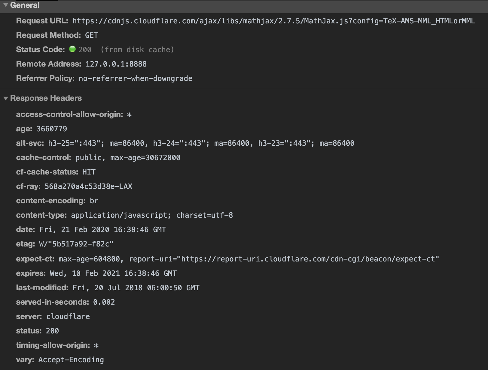

# 缓存

节省流量，节约时间，提升性能


- Expires  
    HTTP在请求返回的response中设置expires，指明该资源的过期时间
    ```java
    expires: Wed, 10 Feb 2021 16:38:46 GMT
    ```
    当下一次,请求同一个资源时，如图所示请求结果是`200(from disk cache)`,表示此次请求资源是从本地读取的缓存

    **问题：**服务端时间和本地时间可能不一样，本地时间可能是未来的某个时间点，导致缓存直接失效，又重新请求服务器该资源
- max-age  
    HTTP1.1中添加名为Cache-Control的Header,结合max-age使用，上图中也有此设置。max-age设置从拿到资源起多少秒之后过期。由浏览器根据本地时间及max-age计算出实际过期时间，和服务端时间就没有关系了。避免了expires中出现的问题。但是如果请求资源之后再去更改时间到未来的某个时间点，依然会使资源失效，这也是没办法的事。  
    优先级比Expires要高，
- Last-Modified 和 If-Modified-Since  
    在超过expires或者max-age的过期时间后，浏览器需要向服务端重新请求资源，如果之前请求资源时服务端给response设置了`Last-Modified`。浏览器在重新请求该资源的时候会携带`If-Modified-Since`头，值就是`Last-Modified`的值。如果服务端判断资源没有更新，则会返回`304(Not Modified)`，表示资源可以继续使用，同时又会更新新的过期时间。如果资源已经发生变更，此时浏览器会返回新的资源，并返回对应的过期时间等。

    **问题：**如果资源文件没有变化，但是更新时间有变化，也会导致返回新资源，而不是304，造成流量及时间等方便的浪费
- Etag 和 If-None-Match  
    解决用修改时间来判断资源变更的问题。可以理解Etag是用资源生成的一个签名，不同资源签名不一样。
- no-cache  
    `Cache-Control: no-cache`，表示资源不可以直接使用，相当于缓存下来但是一直都是过期状态。下次请求需要先向服务端发送请求，由服务端决定是304使用缓存，还是返回新的资源内容
- no-store  
    `Cache-Control: no-store`，表示资源不会存储在本地，每次都需要由服务端返回新的资源内容

- 更多Cache-Control的指令请见[MDN](https://developer.mozilla.org/en-US/docs/Web/HTTP/Headers/Cache-Control)


------------

max-age=0和no-cache实现的都是使用缓存前先去服务端校验一下是否可使用。no-cache是肯定去校验的。而max-age在修改本地时间到过去的时间点的时候，则会出现直接使用缓存而不用服务端校验的情况。
