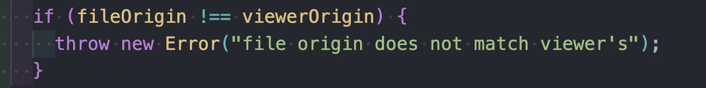

Android 的微信真的是够了，一个二维码内容是一个 pdf 文件地址，在 Ios 上用微信扫码就使用微信内置浏览器预览文件内容，但是在 android 端却是提示`即将离开微信，在浏览器打开`,选择一个浏览器之后却是提示要下载，也并不是直接预览，这个体验其实并不好，而我们需要的就是在 ios端那样的直接预览文件。所以这时候就需要自行去实现这个功能


## pdfjs-dist

这是一个用来专门用来解析和渲染 pdf 的三方库，源自 Mozilla，旗下的 Firefox 浏览器在显示 pdf 的时候用的就是这个。功能很强大，这里只说如何使用这个库来实现我们在 android 微信上直接预览 pdf 文件


从[pdfjs-dist官网](https://mozilla.github.io/pdf.js/getting_started/)下载已经编译好的版本，将目录部署在一个服务器，比如 nginx，我这里使用[anywhere](https://www.npmjs.com/package/anywhere) 在根目录启动一个简单的静态资源服务器。并打开目录下的 `view.html` 文件, 可以看看默认的 pdf 文件


> 警告
>
> 如果没有看到默认的 pdf 展示，可以安装最新的 anywhere 重试


这个 pdf 是这个项目提供的默认的 pdf 文件，如果想要展示自己的 pdf 文件，可以在打开 pdf 文件的时候将自己的 pdf 文件的地址作为参数。比如我本机还有通过 nginx 提供了一个 pdf 文件地址

`http://spare.leeup.top/demo/ECMA-262.pdf`

将这个地址作为参数添加到 viewer.html 的地址上

```
http://192.168.0.100:9090/web/viewer.html?file=http%3A%2F%2Fspare.leeup.top%2Fdemo%2FECMA-262.pdf
```

然后此时浏览器控制台却提示


这是由于 js 代码中对页面的 url 和 文件的 url 进行对比



所以需要修改源码将这个校验的代码下拉注释掉，或者直接不要调用 `validateFileURL` 

然而此时页面依然无法直接预览显示，这是因为跨域了，这也是为什么上面需要判断的原因，解决起来也很简单，给nginx 配置在添加 cors 的相关配置

```nginx
location ~* \.pdf$ {
  add_header Access-Control-Allow-Origin *;
}
```

此时再打开浏览器，就完全可以展示 pdf 内容，此时将地址生成二维码通过微信扫码预览 pdf


## 总结

- 下载 pdfjs-dist 预编译版本，并部署，访问 web/viewer.html 文件
- 修改web/viewer.mjs 文件取消地址源的校验（如果 pdf 文件和 viewer.html 同源可忽略此步）
- 给 pdf 添加header 允许跨域请求
- 将 pdf地址编码后作为参数 file 的值添加到 viewer.html 地址上
- 访问 viewer.html


---

为什么 Android是跳转浏览器面不是直接预览，有知道的么? 请留言告知，谢谢
