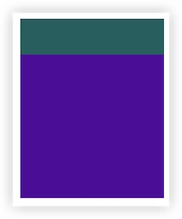
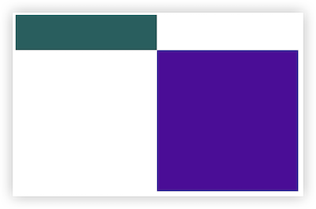
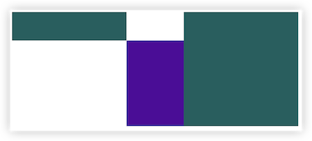

"父相子绝"的定位口诀即将成为历史！CSS Anchor Positioning（锚点定位）正在颠覆我们对元素定位的认知。这个新特性让元素可以自由地锚定到页面任意位置，不再受DOM层级的束缚。

## 锚点定位初体验
想象一下：工具提示不再需要嵌套在父元素中，而是可以直接定位到页面的任何位置。这意味着你可以轻松地创建自定义的弹出框、浮动菜单，甚至是复杂的导航菜单。

```css
/* 定义锚点 */
.trigger {
  anchor-name: --my-anchor;
}

/* 关联定位 */
.tooltip {
  position: absolute;
  position-anchor: --my-anchor; 
  /* 上部对齐锚点的下部 */
  top: anchor(bottom);
}
```


## 这是一次革命

传统定位的一些痛点：
1. 层级限制：定位只能相对于最近的父元素进行定位。
2. 多元素定位：传统无法同时参照多个元素进行定位，这限制了布局的灵活性。
3. 自适应：定位元素的位置通常是固定的，无法根据屏幕尺寸进行自适应。

### 参考兄弟元素定位

```html
<style>
  .anchor1 {
    width: 200px;
    height: 50px;
    background-color: rgb(2, 95, 95);
    anchor-name: --anchor1;
  }

  .target {
    background-color: rgb(82, 3, 156);
    width: 200px;
    height: 200px;
    position: absolute;
    position-anchor: --anchor1;
    top: anchor(bottom);
    left: anchor(right);
  }
</style>
<div class="anchor1"></div>
<div class="target"></div>
```

这样就完成了兄弟元素之间的定位。target的顶部和anchor1的底部对齐，target左侧对齐anchor1的右侧。


### 多元素定位

```html
<style>
  .cont {
    display: flex;
    gap: 100px;
  }

  .anchor1 {
    width: 200px;
    height: 50px;
    background-color: rgb(2, 95, 95);
    anchor-name: --anchor1;
  }

  .anchor2 {
    width: 200px;
    height: 200px;
    background-color: rgb(2, 95, 95);
    anchor-name: --anchor2;
  }

  .target {
    width: 200px;
    height: 200px;
    background-color: rgb(82, 3, 156);
    position: absolute;
    top: anchor(--anchor1 bottom);
    left: anchor(--anchor1 right);
    right: anchor(--anchor2 left);
    bottom: anchor(--anchor2 bottom);
  }
</style>
<div class="cont">
  <div class="anchor1"></div>
  <div class="anchor2"></div>
</div>
<div class="target"></div>
```
这样将目录元素定位在了两个锚点元素之间，不再使用position-anchor属性，直接在anchor()函数中传入锚点的名称。


### 自适应

当前指定的位置空间不够时，自动尝试别的位置
```html
<style>
  body {
    padding: 300px;
    height: 200px;
  }

  .anchor1 {
    width: 200px;
    height: 50px;
    background-color: rgb(2, 95, 95);
    anchor-name: --anchor1;
  }

  .target {
    width: 200px;
    height: 200px;
    background-color: rgb(82, 3, 156);
    position: absolute;
    position-anchor: --anchor1;
    position-area: bottom center;
    position-try-fallbacks: top center;
  }
</style>

<div class="anchor1"></div>
<div class="target"></div>
```
这样在页面滚动时，target元素会自动在上方和下方自动切换位置。

---
现在这个新特性已经被大多已经在chrome, edge浏览器中得到支持，但是其它浏览器还需要再等等

锚点定位里还有些其它属性，不一一介绍，有兴趣的自行发掘