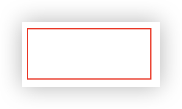
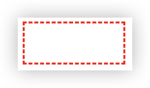

CSS 预处理语言如 Sass 和 Less 长期以来一直提供自定义函数的功能，而现在，原生 CSS 也通过 @function 规则加入了这一强大特性。下面简单介绍一下


## 什么是 CSS @function？
CSS @function 是 CSS 的一个新特性，允许开发者定义可重用的计算逻辑，这些函数可以接受参数并返回值。这与 JavaScript 中的函数概念类似，但完全在 CSS 环境中运行。

```css
@function 函数名(参数1, 参数2, ...) {
  /* 计算逻辑 */
  result: 返回值; 
}
```

### 简单示例

使用函数确定边框样式
```html
<!DOCTYPE html>
<html lang="en">

<head>
  <meta charset="UTF-8">
  <meta name="viewport" content="width=device-width, initial-scale=1.0">
  <title>Document</title>
  <style>
    @function --border(--color: red) {
      result: 1px solid var(--color);
    }

    div {
      width: 100px;
      height: 40px;
      border: --border();
    }
  </style>
</head>

<body>
  <div></div>
</body>

</html>
```

运行效果如下


### 条件样式

```html
<!DOCTYPE html>
<html lang="en">

<head>
  <meta charset="UTF-8">
  <meta name="viewport" content="width=device-width, initial-scale=1.0">
  <title>Document</title>
  <style>
    @function --border(--color: red) {
      result: 1px solid var(--color);

      @media (width > 600px) {
        result: 2px dashed var(--color);
      }
    }

    div {
      width: 100px;
      height: 40px;
      border: --border();
    }
  </style>
</head>

<body>
  <div></div>
</body>

</html>
```



需要把条件样式放在后面，不然样式覆盖了。可以认为result就是一个存储函数返回值的变量，函数执行完后，会把result的值返回

----

现在，我们可以在CSS中使用@function来定义一个函数，但是现在浏览器兼容性还不好，在chrome浏览器需要启用实验性的CSS功能。
在chrome浏览器中，可以通过以下步骤启用实验性的CSS功能：
1. 打开chrome://flags 页面。
2. 搜索 Experimental Web Platform features 并启用它。
