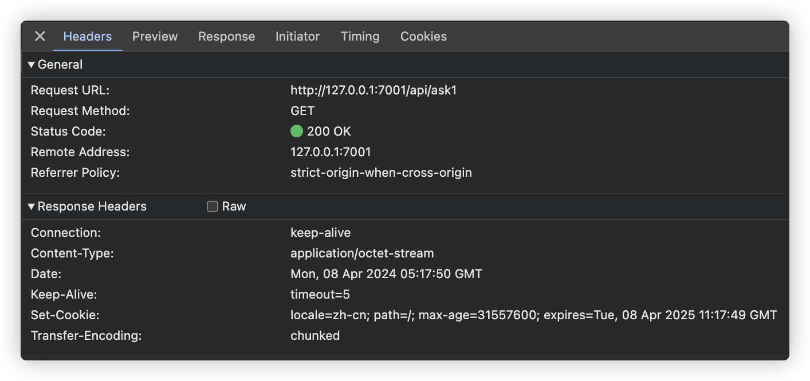
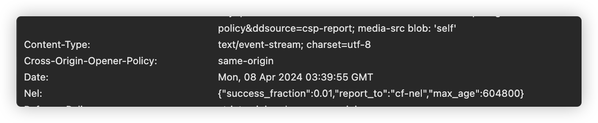
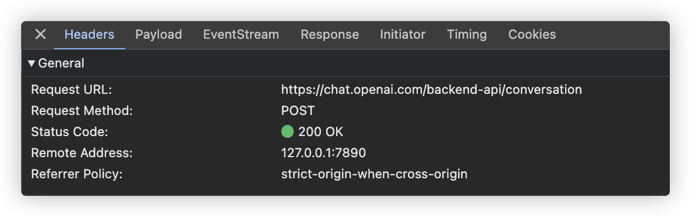
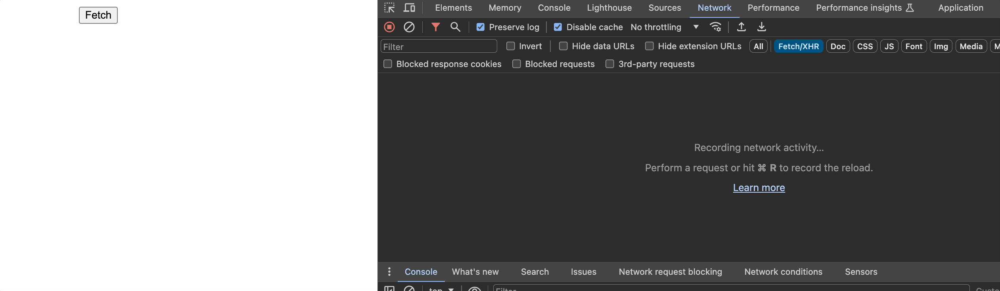

之前写过一篇[『实现接口流式响应数据』](/2024/01/24/%E5%AE%9E%E7%8E%B0%E6%8E%A5%E5%8F%A3%E6%B5%81%E5%BC%8F%E5%93%8D%E5%BA%94%E6%95%B0%E6%8D%AE/index.html)提到了服务端如何分多次将数据传给前端，前端如何接收一点数据处理一点。其应用场景主要是对话式应用，细心的同学可能已经发现它和 ChatGPT 中使用的技术还不太一样，在上一篇文章中响应使用的是`application/octet-stream`看看浏览器的网络面板



再看看 ChatGPT 的请求响应信息



在这张图上发现 chatgpt 的请求的响应进类型使用的是`text/event-stream` 就是这这篇文章的主角


## Server-sent events

服务器发送事件，顾名思义，是由服务端发送数据给前端，简称 SSE。在客户端通过特定事件来接受数据。通常情况下，客户端想要从服务端获取数据，需要向服务端发送请求，附加特定参数，在服务处理完成之后，将数据响应给客户端。一次请求只能响应一次数据。在没有请求时，服务端是无法主要向客户端发送数据的。如果需要服务端主要发送数据，则一般会用 websocket, 这是一种双向通信的协议，连接一量建立以后，客户端和服务端均可以主动向对方发送数据。而 SSE 不同，它使用的依然是 http协议，建立连接之后，只能由服务端向客户端发送数据。而要使用 SSE 就需要服务端在响应数据的时候，将类型设置为`text/event-stream` 并且响应的数据也需要按照指定的格式来发送，客户在收到数据后按规范解析，同时触发相应的事件


## EventSource

EventSource是浏览器提供的一个用于和服务器建立连接，接收服务器发送事件的接口。其基本用法如下

```js
const eventSource = new EventSource('/api/ask2');
eventSource.addEventListener('message', (e) => {
  resultContainer.innerText += e.data;
}) 
```

通过 EventSource 构造函数创建一个实例，将会对指定的 url 的 http 服务开启持久连接，服务端以`text/event-stream` 格式发送事件及数据。此连接将会一直保持开启，直到通过调用 EventSource 的实例的 close 方法关闭


## 数据格式

服务器除了要设置响应头`Content-Type: text/event-stream` 之外 ，发送的数据也是有固定格式的

服务器按行发送数据。每行的数据都是以下格式

```
field: value
```

其中 **field** 可以是**event**, **data**, **id**, **retry**

不是此格式的数据都会被客户端忽略，通过空行来分割多个 message。每遇到一个空行都会将空行前的数据作为一个 message 触发相应的事件

```
data: 初始化数据
id: 1

event: update
data: 更新数据

```

上面的数据将会触发两次事件，第一次事件名为默认的 message, 数据就是 data 部分的内容，第二次触发的事件名为指定的 update, 数据也是data部分的内容，如果一个 message 内,  data, id, retry 部分都没有，这个 message 也变得没有意义，会被忽略。


## 自动重试

当连接建立后，如果因为某些原因，连接和服务端的连接断开了，客户端会自动尝试重新建立连接，同时会携带一个特殊的请求头`Last-Event-ID`， 这个值会在以前触发的事件中查找，从最后一次有 id 传回的消息中获取，使用 `lastEventId` 属性名从事件对象中获取。在上面的示例中，如果第二个消息触发后，连接中断，那么自动重试的时候，请求关中将会增加 `Last-Event-ID: 1`

当连接中断，客户端并不是立即重连，而是在等待一断时间后再发起重连。而这等待时间正是通过 retry 指定的，单位是 ms, 在服务端发送事件时可以通过 `retry: 5000` 来告诉客户端如果连接中断，需要等5s 后再发起重连。


## 请求方式

虽然浏览器给我们提供了 EventSource 接口，但是使用 EventSource 建立的连接使用的是 get 方式，如果仔细观察 ChatGPT 的请求信息，将会发现它使用的 Post 请求



这就说明 ChatGPT 并不是使用的浏览器提供的EventSource 接口，而使用的 [Azure/fetch-event-source](https://github.com/Azure/fetch-event-source), 其内部使用 fetch 发送请求，同时在接收到数据后按照规则解析，然后触发相应事件


## 自己动手

虽然已经有很多封装好的库了，但是为了学习，还是自己动手写一个吧。仓库地址[leemotive/fetch-event-source](https://github.com/leemotive/fetch-event-source)

除了支持 EventSource 和 fetch 的接口配置外, 还支持一些额外的配置
| 参数 | 类型 | 默认值 | 描述 |
| --- | --- | --- | --- |
|json|boolean|false|如果 data 为 json 是否自动解析返回的 json|
|serverEnd|boolean|false|如果服务端主动关闭连接，客户端不再尝试重连|

### 示例
```js
const eventSource = new FetchEventSource.default('/api/ask2', {json: true, serverEnd: true});
eventSource.addEventListener('msg', (e) => {
  resultContainer.innerText += e.data;
})
```
服务端代码,midway.js作后端示例，只截取了部分代码
```js
@Get('/ask2')
async ask2() {
  const result = [...'人间四月芳菲尽，山寺桃花始盛开，长恨春归无觅处，不知转入此中来。'];
  const passthrough = new PassThrough();
  const push = (i: number) => {
    if (result[i]) {
      passthrough.write(`event: msg\ndata:${result[i]}\nid: ${i}\n\n`);
      setTimeout(push.bind(null, i + 1), 100);
    } else {
      passthrough.write(`data: 结束了\n\n`);
      passthrough.end(); // 服务端主动断开连接
    }
  };

  setTimeout(() => {
    passthrough.write('retry: 8000\n\n');
    push(0);
  });

  this.ctx.response.set({
    'Content-Type': 'text/event-stream',
  });
  return passthrough;
}
```




