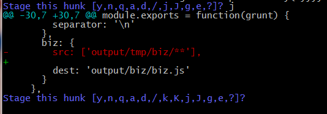

一直好奇，sourcetree是怎么做到将一个文件里的多块修改分区块部分添加提交。甚至按行级别进行提交，今天终于知道怎么实现的了

其实就是用 git add 命令，只不过要加上 -p 这个参数

  
先看这个文件的变化，修改，删除一行（换为空行），新增加一行。

下面就介绍如何只提交最后一个区块（hunk）

sourcetree中很简单，只需要点击一下stage hunk就好了，那git add -p是怎么实现的呢

  

可以看到现在显示的是第一个区块，最后一行是需要我们来做决定，需要输入命令来操作这个区块，暂时选择 j, 什么意思等到下个区块再看

  

现在下面蓝色的选项比之前多了k, K，至于这里面每项表示什么意思，git官网的文档上有，这里只要直接回车（默认就是？表示help嘛）

  

这里面对每一项做了解释，这样就不需要记住第个选项的意思了，需要就看一下就好了。

比如选择g的时候，会出现下面这样的选择

  
三处修改选择一个前往，我们要提交第三个区块，所以选择3

在出现第三个区块先项时，选择y,表示暂存此区块

  
在看此时的文件状态，第三个区块已经被暂存

下面看如何按行提交，比如提交剩下的两个区块每二个区块中的删除行，而不要新增加行

仍然是 git add -p命令

在出现这个区块是，选择e

  

接下来就会进入编辑环境，需要知道点vim的知识

  

进行编辑，请关注红框的位置

  
请对比修改前后的区别

最后通过 :wq 保存并退出编辑

  

可以看到删除已经暂存，但是添加行还在，没有被暂存。

再看看已经暂存的修改

  
第三区块， 第二区块的一行，两处都在这了。

如果想取消这些暂时或者部分区块，或者按行级别，其实和刚才的操作类似，只是用的是git reset命令

通过git status 查看文件状态，可以看到提示

  

通过git reset HEAD 这个命令就可以了，如果分区块或者按行级别请加 -p 参数。其它的和暂存的时候是一样的，这里就不做演示了

