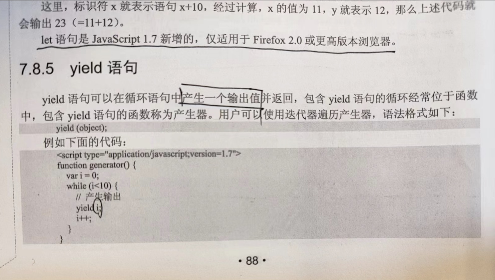

近些年在前端项目中涉及到异步代码基本都能看到 `async/await` 的身影，他的最大的作用就是能够中断当前代码的运行，当 `await` 后面的 Promise 对象的状态变成 fulfilled 的时候才继续接着执行后面的代码。这就让之前一些传递回调函数的写法变成了同步的代码方式。那么 async/await 是怎么回事呢


## 回调式写法

一开始异步的写法全靠回调函数嵌套回调函数比如下面的代码

```js
$.ajax({
  success() {
    $.ajax({
      success() {}
    })
  }
})
```

在一些有一定年头的项目里，类似的代码不在少数，非常容易形成回调地狱的问题，代码嵌套层次深缩进大，导致结构混乱可读性降低。当然如果你能力好，把一些回调函数封装成独的函数，可能会提升一点代码质量，但是避免不了回调函数被传递来传递去，最后都不知道传递进去的函数会在什么时候被调用


## Promise

随着的 Promise 的出现，回调地狱的问题有的缓解，因为它带来一种新的编程方式

```javascript
fetch(url).then(handle1).then(handle2).then(handle3)
```

上面的代码实现了在请求完成后，按顺序执行回调函数，每个回调函数执行完成后返回一个结果，这个结果会被传递给下一个回调函数

这就把多个回调函数按一定的顺序链起来了，当页面的回调函数成功执行并返回结果时才会触发下一个回调函数的执行，这样的结构是有顺序的，所以感觉上就更有条理了。然后我们代码并不是顺序执行的，这也是面试常考问题，给你一个函数，里面一堆 setTimeout Promise console 然后问你console 的输出顺序


## async/await

这就再进一步了，把 promise 的这种异步回调的方式同步的方式来编写，进一步的优化代码结构，增强代码可读性

```javascript
async function main(url) {
  let res = await fetch(url)
  res = await handle1(res)
  res = handle2(res)
  return handle3(res)
}

```

这样在main方法内部将以同步的方式来执行代码，虽然 js 执行代码还是有异步处理，但是从代码上看，后面的处理函数一定是在前面的处理函数完成之后才会执行。


那 async/await 是什么呢，它其实就一种语法糖。是生成器 `Generator` 的语法糖，其实 async/await 最大的作用就是中断方法执行，然后在适当的时机恢复执行。而在 js 里这正是生成器的功能，那什么又是生成器呢，其实就是通过星号标记的函数

其实生成器早在2011年就有了




这是我 2012 买的 **JavaScript 权威指南** 里的一个截图，这本书当时翻译是生成器，和截图里上面的 let 语句一样，yield 语句也是1.7新增，当时只适用于Firefox2.0及更高版本浏览器。可能当时这些只是提案吧。语法还不稳定，当时定义 Generator 函数都不需要星号。而且还有 let 语句，如今 let 已经是作为声明变量的关键这了。当年看到这章节的时候也是一头雾水。完全不知道这个东西的应用场景。直到后来 async/await 的兴起


## 自行包装

既然 async/await 是语法糖，那能不能自己封装一个呢，当然是可以的。直接上代码

```javascript
function generatorToAsync(executor) {
  // 这是其实可以判断一下executor应该是一个可执行函数
  function handler(gen, res, resolve, reject) {
    if (res.done) {
      return resolve(res.value);
    }
    if (typeof res.value.then === "function") {
      res.value.then((r) => gen.next(r)).then((r) => handler(gen, r, resolve, reject), reject);
    } else {
      Promise.resolve(res.value).then((r) => handler(gen, r, resolve, reject));
    }
  }

  return function (...args) {
    const { promise, resolve, reject } = Promise.withResolvers();
    try {
      const gen = executor.apply(this, args);
      if (Object.prototype.toString.call(executor) !== "[object Generator]") {
        resolve(gen)
      } else {
        handler(gen, gen.next(), resolve, reject);
      }
    } catch (err) {
      reject(err);
    }
    return promise;
  };
}
```

代码中的 `Promise.withResolvers` 是 ECMAScript<sup>®</sup>2024 中引入的新功能，有不了解的可以参考[Promise这个新api有点香](https://juejin.cn/post/7310038698338844735) 

在使用时需要定义一个生成器函数


```javascript
function* asyncFunction(args) {
  console.log(args);
  const res1 = yield new Promise(resolve => setTimeout(resolve, 1000, "yield1"));
  console.log(res1);
  const res2 = yield new Promise(resolve => setTimeout(resolve, 1000, "yield2"));
  console.log(res2);
  throw "return 3";
}

generatorToAsync(asyncFunction)("args").then(console.log, console.error);

```

如此执行在 asyncFunction 内部将顺序间隔1s 输出 args, res1, res2。且不用关心何时调用生成器的 next 方法，包装方法中会在 promise 完成的时候自动调用next 触发生成器的继续执行。这也 async/await 要干的事


-----


早在2011年，这本JavaScript权威指南中就已经讲了各种新技术了，生成器，数组的 forEach, filter, reduce 等方法，SSE,  Storage, Worker等，然而我清晰的记得，当时还是项目中疯狂使用jQuery, 以及一个叫DWZ的富客端开源框架，这些新技术基本都没用上，当然可能最主要的原因就是当年要兼容 IE😅
