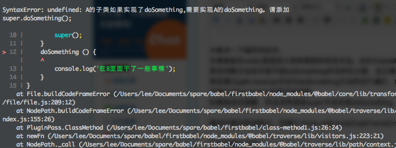

在开发中需要使用babel将目前浏览器还不支持的js特性，转化为浏览器能运行的版本。

然而有一些业务上的特性，babel是不可能帮我们做的，需要自己去开发babel插件并运用到我们的项目里面

比如说有两个类


​    
```js
class A {
    doSomething() {
        console.log('在A里面干了一些事情');
    }
}

class B extends A {
    doSomething() {
        console.log('在B里面干了一些事情');
    }
}
```

类B在自己的类里面写了自己的方法，但是如果我们的项目要求我们A的子类如果需要实现自己的doSomething必须要先执行A的doSomething。因为A中可能干了一些通用的事情，不必要每个子类自己再实现一遍，如果不调用父类A的方法可能会导致一些未知的错误或者其它问题。这样的需求靠人工复查代码显然是费时费力又难以保证品质的。还是交给程序比较靠谱。

编写插件文件 myplugin.js


​    
```js
module.exports = function(babel) {
  const t = babel.types;

  return {
    visitor: {
      ClassMethod (path) {    
        if (path.node.key.name == 'doSomething' && path.parentPath.parent.superClass && path.parentPath.parent.superClass.name === 'A') {
          var hasCallSuper = false;
          path.traverse({
            CallExpression(path){
              if (t.isMemberExpression(path.node.callee) && t.isSuper(path.node.callee.object) && 'doSomething' === path.node.callee.property.name) {
                hasCallSuper = true;
                path.stop();
              }
            }
          });
          if (!hasCallSuper) {
            throw path.buildCodeFrameError('A的子类如果实现了doSomething,需要实现A的doSomething。请添加\nsuper.doSomething();\n')
          }
        }
      }
    }
  };
};
```


​    

大致讲一下插件的实现：

主要就是在visitor里面定义各种类型的检测方法。此处ClassMethod就是用来检测类方法的

首先判断方法名字是不是doSomething并且存在父类，且父类名字是A

然后通过path.traverse方法对doSomething方法的进行遍历，traverse方法的参数其实也是visitor。

这是CallExpression则是方法调用。

如果是成员函数，并且调用者是super方法名是doSomething，则标记已经调用过super.doSomething

最后如果没有调用过。刚通过 throw path.buildCodeFrameError('错误提示消息') 来提示用户

运行效果如下图：

  

给出错误消息并提示了代码位置。

以上只是一个简单的应用场景，根据不同业务场景，需要编写更为复杂的插件。

