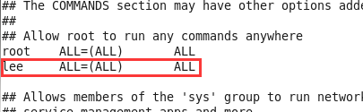

装好的VirtualBox后挂载共享目录


​    
```bash
sudo mount -t vboxsf vmshare ~/vmshare
```

岂料以提示 xxx is not in the sudoers file

该死的centos，用ubuntu是没有这种问题的

这时要通过 su 切换到root用户

然后执行


​    
```bash
visudo
```

添加红框中的文本


  

请用自己的用户名替换。

