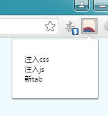
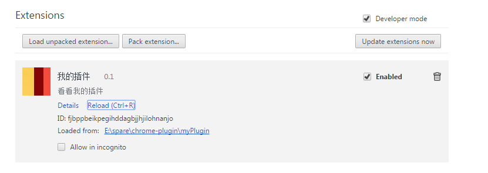

最近看了下Chrome插件的开发  

新建一个目录作为插件的要目录，在目录下新建 manifest.json文件


​    
```json
{
    "name": "我的插件",
    "version": "0.1",
    "manifest_version": 2,
    "description": "看看我的插件",
    "icons": {
        "16": "statics/img/16.png",
        "48": "statics/img/48.png",
        "128": "statics/img/128.png"
    },
    "browser_action": {
        "default_icon": "statics/img/16.png",
        "default_title": "我的插件",
        "default_popup": "template/pop.html"
    },
    "permissions": [
        "tabs", "http://*/"
    ],
    "homepage_url": "http://leeqq.iteye.com"
}
```

  

"browser_action" -> "default_popup" 指向 插件的弹窗页面，如  

  

在 template/pop.html中引入 ../statics/js/pop.js  

绑定 事件  


​    
```js
var get = document.getElementById('get');
get.addEventListener('click', function () {
  chrome.tabs.insertCSS({file:'statics/css/insert.css'});
})

var update = document.getElementById('update');
update.addEventListener('click', function () {
  chrome.tabs.executeScript({file: 'statics/js/insert.js'}, function () {
  });
});

var create = document.getElementById('create');
create.addEventListener('click', function () {
  chrome.tabs.create({
    index: 3,
    url: 'template/newpage.html',
    selected: false
  }, function (tab) {
    console.log(tab);
  })
});
```

  

分别是往当前页面注入css,js和打开新的tab

在Extension页面点击 Load unpacked extensions，选择要目录安装插件

  

这里的api不多做介绍，可以参照网上的api，这里附上360的平台地址  

http://open.chrome.360.cn/extension_dev/overview.html  

或者访问chrome官网  

https://developer.chrome.com/extensions  


  