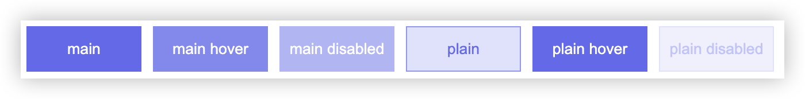

你还在为写不同的颜色而发愁吗？一个按钮有很多种颜色，你怎么写？鼠标悬浮上去的颜色，禁用时的颜色，点击时的颜色，你都怎么写？然后还不只一种类型的按钮，primary, info, danger, warn, scuccess 这种常见类型的按钮，都需要写很多种颜色。

聪明的你可能会想到使用sass预处理器，它提供了darken和lighten函数。然而现在css已经支持了color-mix函数，它可以让你秒变调色大神。

## 基本语法
```css
color-mix(<color-interpolation-method>, <color>[<percentage>], <color>[<percentage>])
```

## 一学就会的调色魔法
color-mix()就像个调色盘，把两个颜色倒在一起搅和搅和：
```css
div {
  background-color: color-mix(in srgb, red 60%, blue);
}
```
下面就是60%红色和40%蓝色的混合结果


## 按钮主题色
[element-plus/button](https://element-plus.org/zh-CN/component/button.html#%E8%87%AA%E5%AE%9A%E4%B9%89%E9%A2%9C%E8%89%B2) 提供了自定义主题色的功能，通过color属性设置主题色，组件会自动生成不同状态下的颜色。而element-plus中是通过 [@ctrl/tinycolor](https://www.npmjs.com/package/@ctrl/tinycolor) 库来实现的，它是一个非常强大的颜色处理库，支持多种颜色格式，包括RGB、HSL、HSV、HEX、HSB等。

现在我们来看看如何使用color-mix函数来实现自定义主题色。
```css
.btn {
  width: 100px;
  height: 40px;
  display: flex;
  justify-content: center;
  align-items: center;

  --main-color: #626aef;
  background-color: var(--main-color);
  color: white;
  border: none;

  &:hover {
    background-color: color-mix(in srgb, var(--main-color) 80%, white);
  }

  &:disabled {
    background-color: color-mix(in srgb, var(--main-color) 50%, white);
  }

  &.plain {
    background-color: color-mix(in srgb, var(--main-color) 20%, white);
    color: var(--main-color);
    border: 1px solid color-mix(in srgb, var(--main-color) 70%, white);

    &:hover {
      background-color: var(--main-color);
      color: white;
      border: none;
    }

    &:disabled {
      background-color: color-mix(in srgb, var(--main-color) 10%, white);
      color: color-mix(in srgb, var(--main-color) 40%, white);
      border: 1px solid color-mix(in srgb, var(--main-color) 20%, white);
    }
  }
}
```


代码中的混合比例我就大概写了一下，实际功能开发可能需要根据设计稿来调整。这样完全使用css根据主色值，快速生成不同状态下的各种颜色了。有些渐变色的按钮也是可以的，只要使用color-mix生成好不同位置的颜色，然后使用linear-gradient函数生成渐变效果即可。


## 兼容性
主流浏览器都支持color-mix函数，包括Chrome、Firefox、Safari、Edge, Opera等。应该可以这么放心使用了


----
color-mix函数的第一个参数支持很多格式。本文中使用的是srgb,还支持lab, hsl等各种颜色格式。可以根据需要选择合适的颜色格式。具体的可以参考[mdn](https://developer.mozilla.org/en-US/docs/Web/CSS/color_value/color-mix#formal_syntax)文档。

