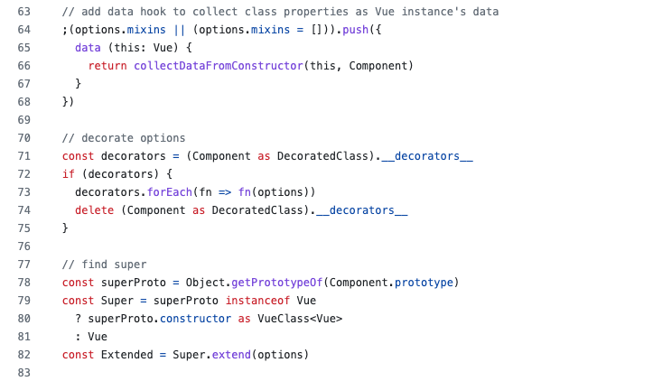
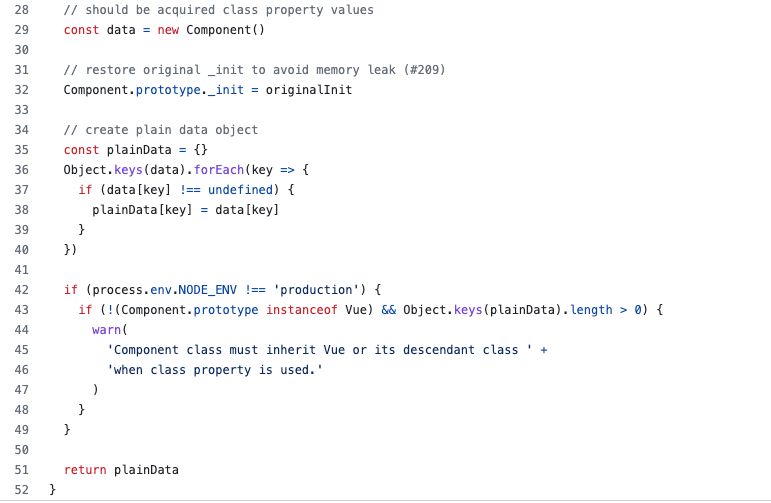
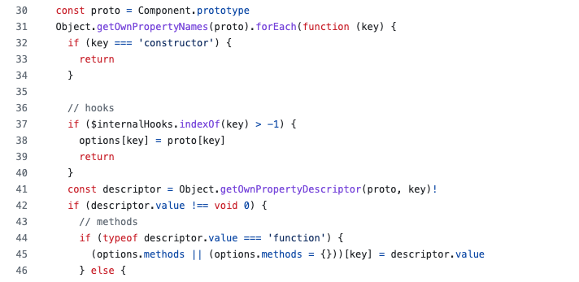
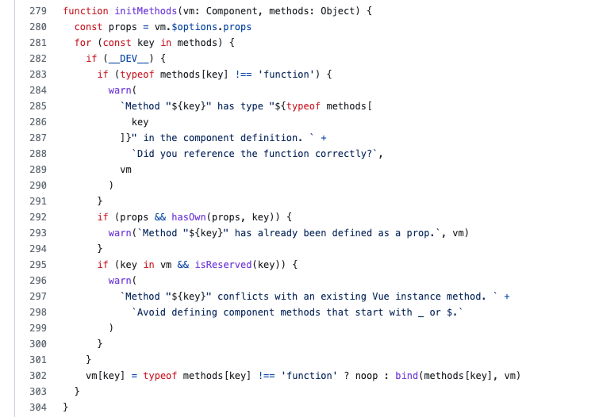

又是一坑，坑到你没脾气。项目使用 **vue2 + vue-property-decorator** 实现用 ts 以 class component 的方式开发。接下来先复现一下问题

## 问题

在 data 中定义的数据，在发生变更后，在一些回调函数中取不到更新后的值，在另外一些回调函数中又能取到最新的值。在那些取不到最新值的函数中，并不是所有数据变更都取不到，有些数据的变更又是可以取到的。这段描述很绕人，看示例代码吧。

```js
import { Vue, Component } from 'vue-property-decorator';
 
@Component({
  name: "ExamplePage",
})
export default class ExamplePage extends Vue {
  count = '1'
  docForm = {
    code: '123'
  }
  validate = () => {
    console.log(this.count, this.docForm);
  }
  output() {
    console.log(this.count, this.docForm);
  }
}
```

上面的代码中当 count 和 docForm.code 和页面上的输入框进行绑定，当值发生改变后，只有在 validate 方法中 count 属性无法获取最新，其它输出都是变更后的值

```js
// 变更前
1 123  // validate 输出默认值
1 123  // output 输出默认值
// 变更后
1 1230  // validate 输出 count 仍然是开始的默认值，docForm.code 是变更后的值
10 1230 // output 输出 都是变更后的值
```

其实看到这个示例，有经验的已经猜了个大概了。通过对比区别有两个，**一是属性 count 和 docForm 的数据类型不同，二是两个函数 validate 和 output 定义方式不同**。第一个区别一般涉及的问题是深浅拷贝，值传递，引用传递。第二个区别涉及就只是 this 指向问题了。

## 方案

validate 方法是要做为参数传递给别的方法作为回调函数的。应该是为了固定 this 指向，当时的开发人员（想当然，过往经验）使用了箭头函数的写法，在当时的需求中，可能只使用了 `this.docForm` 这种对象属性，所以并没有产生什么问题。所以一直是岁月静好一派祥和。直到有人想在 validate 方法中使用 count 的醒候，然后就原地爆炸了，docForm 下面的属性能获取到, count 属性拿不到。

其实要解决问题很简单，**把 validate 方法改成 output 这种写法就行了**，会自动绑定 this 指向的。不需要使用箭头函数 

## 为什么

解决问题很简单，可是为什么，为什么换成箭头函数之后，能取 docForm 的属性值，count 却取不到。它们的 this 到底分别指向了谁。

1. validate 写成箭头函数到底发生了什么   
   这个是 class 方式定义类的时候的一种写法，可以将函数 this 固定为类的实例对象。上面的代码，除去 extends 部分，可以等价下面的代码    

   ```js
   export default class ExamplePage {
     constructor() {
       this.count = '1';
       this.docForm = {
         code: '123'
       };
       this.validate = () => {
         console.log(this.count, this.docForm);
       };
     }
     output() {
       console.log(this.count, this.docForm);
     }
   }
   ```

   可以看出来了吧，validate 方法是在构造实例对象的时，直接赋值给类的实例的，而 output 方法却是在原型对象上的，能够调用 output 方法是因为原型链的存在。如果对原型，原型链还算熟悉的话，这里应该很好理解

2. 为什么能取 docForm 对象中的属性，但是取不到 count  
   这个问题需要看看 `@Component` 这个装饰器干了什么事了，相关的代码如下  
     
   给 option 添加 mixins，内容是 data 函数，是不是和平时通过 option 的方式写 vue 组件时很像

   那再看一下 `collectDataFromConstructor` 中主要做了什么

   

   主要逻辑就是 new 一个实例，并且把它自身的属性浅拷贝到 plainData 对象并返回，这就是我们平时写组件时 data 函数返回的那个对象。**这里 validate 方法也会被拷进 plainData 中，但是 output 方法不会**， validate 方法中的 this 已经被固定指向这行代码 `const data = new Component()` 创建的 data 对象了，之所以能访问 docForm 下的属性并获取到最新的值，仅仅是因为这里使用了浅拷贝  

3. output 是如何被 vue 识别的
     output 只是类原型上的方法，如何被 Vue 组件 option 识别是的

     

     Vue 的生命周期函数和普通的函数都在这里处理的，不解释

4. Vue 是如何固定 methods 中定义的函数的 this 指向的

     这个需要在 vue 源码中找了

     

     这是 vue 源码中的一段，其功能就是将 methods 中定义的函数通过 bind 方法来绑定 this 。


---

又是填坑的一天，methods 方法就直接写普通函数就好了哎，想当然的写了个箭头函数。先写普通函数，如果有问题再说嘛。有些坑根本没想坑你，只因为你想的太复杂，反倒成了坑
