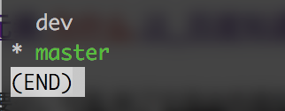
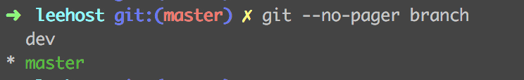
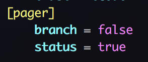

最近安装了新的git,一开始也没有什么，直到使用了`git branch`这个命令查看所有分支的时候出现了不同，命令将结果以`less`的方式进行展示如下图

有点不习惯了，还是习惯以前在当前窗口直接显示的方式。

可以在执行`git branch`的时候添加 --no-pager 参数, 如下图

也可以通过全局配置
`git config --global pager.branch false`
设置完成之后分支列表展示结果如下

当然这种不仅针对branch命令的，对于status,log命令也可以设置是否以less的方式展示

比如设置status  

如此设置之后`git status`命令也将以less方式展示

  