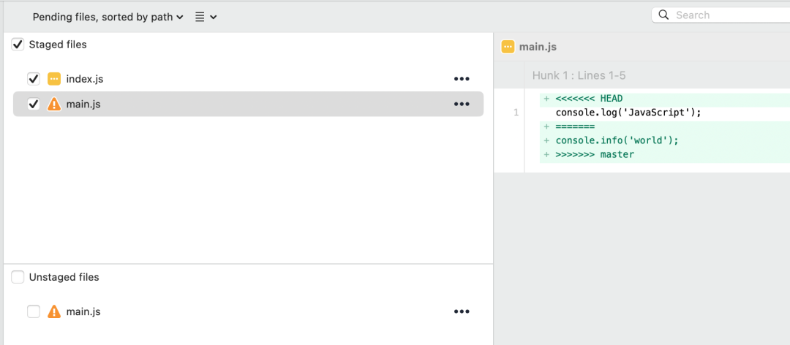
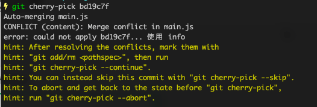
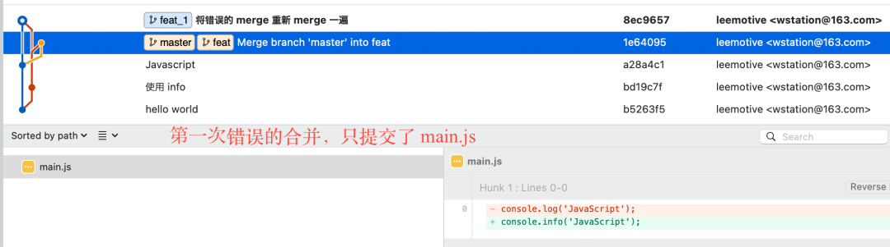
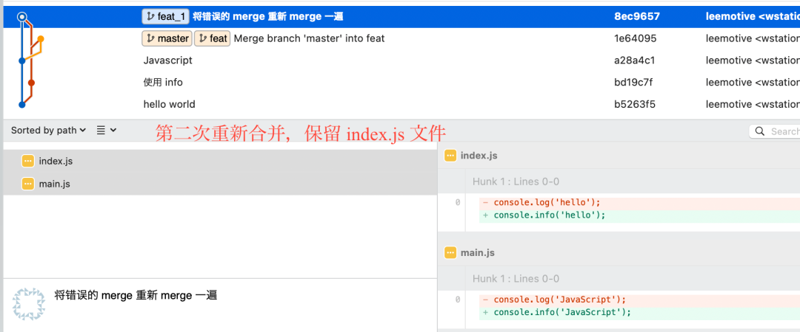
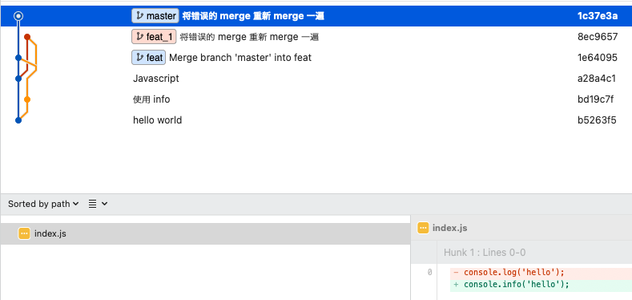

## 代码丢了

在日常工作中，经常要使用 merge 操作，将一个分支的代码合并在到另一个分支，而合并冲突更是家常便饭，可能如果有一天一不小心在合并代码的时候把部分的代码弄丢了，怎么办？前事不忘后事之师，今天就来讲讲我的亲身经历


## 问题重现
1. 合并冲突  
    如果合并时没有任何冲突，那么在合并时输入message, 就会自动完成 merge commit 并不给你弄丢代码的机会，所以也只在有冲突的时候，由于某种原因，操作失误把别人的代码弄丢了
    
2. 删除别人的文件
    下图是在 feat 分支执行合并 master 后产生的冲突， 文件index.js是 master 分支的修改，在 feat 分支并没有任何修改  

在解决完 main.js 的冲突之后，需要执行 git add 操作，重新添加 main.js，但是千万不能将 index.js 取消选择，如果取消了，那将丢失了 index.js 中的修改内容  
  
3. 丢失代码
    在解决冲突后，如果以为只要提交自己修改的文件的，而把别人的文件取消后 commit, 那别人的代码将正式被弄丢，当把 feat 分支合并回 master 后，别人将会发现自己之前辛辛苦苦修改的代码又恢复原样了，这真是活见鬼了。
    
 
## 代码找回
使用版本管理工具的好处之一就体现出来了，当发现同事不小弄丢了你的代码之后，不要惊慌，你自己提交代码 commit 还在，即使你对 Git 不熟，也可以找到当时的提交记录，对照个修改记录重新改一遍，重新提交一遍就可以了，不过就是多花了些时间而已，让删掉你代码的同事请你喝杯咖啡补偿一下吧。

对于小改动，这么手动重新修改一遍尚可，如果改动特别多，而且特别琐碎，当时改的时候就已经花了很长时间，如今虽然对照着改，也要花不少时间，也难免给改错了，这就可能是一杯咖啡解决不了的问题了。

**那应该如何改呢？这就需要今天的主角 `cherry-pick` 来救场了**。如果只有只涉及一次 commit 中的代码丢失，那使用 `cherry-pick` 来将以往的代码重新提交一次就行，如何有冲突，根所提示解决冲突，添加文件然后执行 --continue 继续  




  
如果涉及很多次提交，很多人的代码，想要将所有的commit 都找出来，其实也不是件容易的事。

这时我们可以将丢失代码的那次合并重新执行一下，正确解决冲突添加文件，然后对这次正确的合并进行 cherry-pick。以下是第一次错误合并和第二次合并的对比





  


这时候分支切回 master 但不要使用  merge 的方法把 feat_1 分支合进来，如果这样操作，你可能会发现这次合并什么都没有，master 分支上的 index.js 也没有任何改动。这时仍然要使用 cherry-pick 命令，把正确的merge commit 给提取过来


```bash
$ git cherry-pick -m 1 8ec9657
```




从这里可以看出丢失的 index.js 内容已经重新找回
