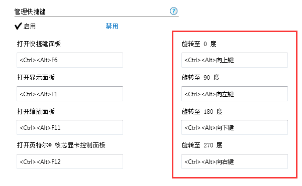
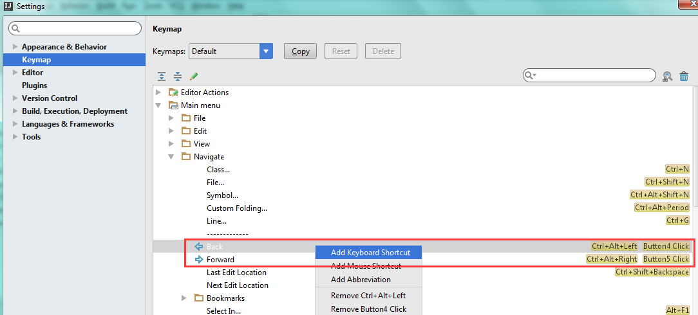

最近因公司项目又用回idea作为开发工具，遇到一个问题。如何回到上次编辑的地方（鼠标之前的位置），快捷键是什么，在网上搜寻了一下，有文说是 Ctrl + Alt + left(right)。可是我试了一下，鼠标没回去，整个屏幕方向变了，这什么鬼……

原来Ctrl + Alt + left(right) 这个快捷键被系统占用了。变成改变屏幕方向的快捷键。真够坑的

  

所以要自行设置idea

  

我已习惯了Sublime中的 Alt + - (Shift + Alt + -)

这样才舒服

