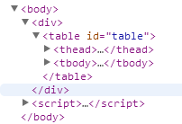
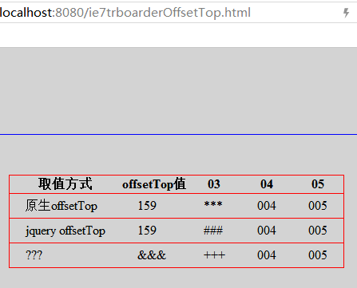
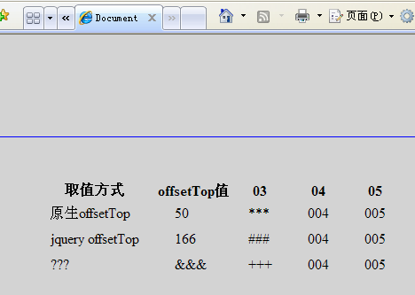
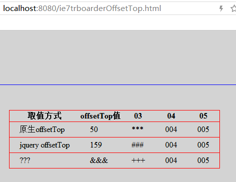
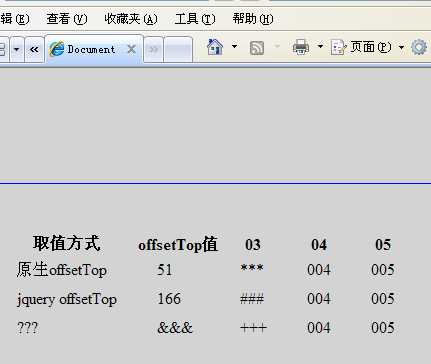
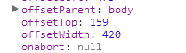
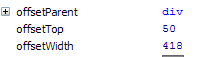
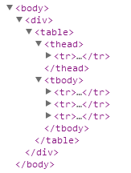
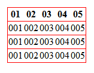
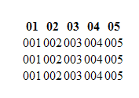

最近在项目遇到关于IE7的两个问题，一个是offsetTop一个是tr的边框

一. offsetTop

前段时间因项目需求需要计算表格到浏览器顶部的距离，以便在滚动的时候，固定表头，很自然的用到了offsetTop这个属性

dom结构如下

  

主要样式如下


​    
```html
body{
    padding-top: 100px;
    background: lightgrey;
}
div{
    border: 1px solid blue;
    padding: 50px 0;
    height: 300px;
}
```

注意要div要加上height样式

chrome等浏览器结果如下


  

原生offsetTop和通过jquery的 offset().top取到的值一样

IE7中值如下

  

原生offsetTop和通过jquery取到的是不一样的，很显然通过jquery取到的到body顶部的距离，而原生offsetTop则是到div顶部的距离，至于chrome是159，IE7是166这不用纠结，这个是ie和chrome在解析的时候的差异，这里不用管

上面说到要加上div高度的样式，因为如果div不设高度，chrome和ie表现是一样的。都是到body顶部的距离

接下来再修改一下div的样式，加上


​    
​    position: relative

同时可以去掉高度的样式

这样再来看看分别是什么值

chrome的表现

  

IE7的表现

  

可以看到chrome和IE7表现一致的，原生offsetTop都是相对div的距离，而jquery仍然取的是相对body顶部的距离

那么为什么会有时相对body，有时相对body呢。这就要看offsetParent属性了

在没有position只有高度的时候

chrome中

  

而IE7中

  

这就导致了值不一样，更多关于offsetParent的东西请自行google

所以，再遇到页面需要滚动到顶部然后固定表头这样需求的时候，最好选用jquery来取值，当然如果可以用


​    
​    position:sticky

这样的样式那是皆大欢喜的，都不用再去计算什么的，省了一堆事

二. tr的边框

dom结构如图

  

样式如下


​    
​    table{
​        border-collapse: collapse;
​    }
​    tr{
​        border: 1px solid red;
​    }

在chrome等浏览器中呈现如下

  

是有边框的，而在IE7中却是没有边框的，如下

  

所以在要兼容IE7等低版本的浏览器的实现中还是要针对td,th来设置边框，确保显示统一

