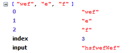
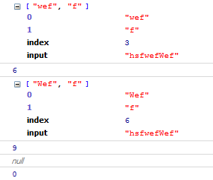

1. indexOf方法

   查找子串起始位置

   ```js
   var str = 'hsfwefwef';
   var k = str.indexOf('wef')
   console.log(k)
   ```

   结果是3，明显是匹配的首次出现的位置

   ```js
   var str = 'hsfwefwef';
   var k = str.indexOf('wef', 4)
   console.log(k)
   ```

   此时匹配位置是从下标4位置处开始的，结果是6。 lastIndexOf与此类似，只是查找的是最后出现的位置

2. serach方法

   ```js
   var str = 'hsfwefwef';
   var k = str.search(/wef/)
   console.log(k)
   ```

   同样找的是首次出现的位置3，不过这里用的是正则匹配。

   ```js
   var str = 'hsfwefwef';
   var k = str.search(/Wef/i)
   console.log(k)
   ```

   忽略大小写，结果为3，但是这个方法忽略全局模式g。也就是说找不到第二个匹配的位置。

3. match方法

   ```js
   var str = 'hsfwefWef';
   var k = str.match(/W(e)(f)/i)
   console.log(k)
   ```

   用指定参数正则和字符串匹配，结果是

   

   结果是个数组，元素1是匹配到的符合正则的字符串，后面依次是$1, $2……($1, $2意义参照正则表达式)

   另外还有两个属性，index:字符串的起始位置，input:原始字符串

   同样没有匹配到第二个，这时可以用全局模式/g

   ```js
   var str = 'hsfwefWef';
   var k = str.match(/W(?:e)(f)/ig)
   console.log(k)
   ```

   结果是  

   返回了字符串中符合正则的两个子串。但这是没$1,$2……更没有index,input属性。

   如果获得详细的信息。请使用 RegExp.exec()

   ```js
   var str = 'hsfwefWef';
   var reg = /W(?:e)(f)/ig;
   var k;
   while(k = reg.exec(str)){
     console.log(k);
     console.log(reg.lastIndex)
   }
   console.log(k);
   console.log(reg.lastIndex)
   ```

   结果是

   

   看到所有的能匹配正则的子串都能找到，这依赖于正则对象的lastIndex属性。当不能匹配的时候返回值得是null,

   同正则对象的lastIndex属性也被置为0。lastIndex其实就是用来标识下次匹配的时候从字符串什么位置开始。

4. replace方法

   ```js
   var str = 'hsfwefWef';
   var k = str.replace('wef', 'pod');
   console.log(k);
   ```

   结果很明显是hsfpodWef。第一个参数用来指定要被替换的字符串，第二个参数是替换文本

   ```js
   var str = 'hsfwefwef';
   var k = str.replace('wef', function(s){
     return s.toUpperCase();
   });
   console.log(k);
   ```

   第二个参数是函数的话，此函数接受3个参数，被替换的字符串，起始位置，原始字符串。函数的返回值作为替换文本。所以结果是 hsfWEFwef

   

   js里面没有java中的replaceAll方法。但可以用正则实现，将replace方法第一个参数写成正则表达式并且是全局模式。

   ```js
   var str = 'hsfwefwef';
   var k = str.replace(/wef/g, function(s){
     return s.toUpperCase();
   });
   console.log(k);
   ```

   结果是hsfWEFWEF， 正则表达式是全局模式，能被匹配的所有子串，都要作为参数调用函数，用返回值替换。这里函数的参数顺序是

   正则匹配到的子串，$1, $2……，子串位置，原始字符串。

   当第二个参数仅仅是一个字符串时，其中有$有特定的含义。

   $1,$2,$3…… 不多说

   $& 正则匹配的子串

   $` 正则匹配的子串左侧文本

   $' 正则匹配的子串右侧文本

   `$$ 直接文本量$`

   ```js
   var str = 'hsfwefwef';
   var k = str.replace(/w(e)f/g, '$\'$1$`');
   console.log(k);
   ```

   结果hsf wef e hsf e hsfwef 用空格空开，看得更清楚点。

5. substring

   抽取子串

   ```js
   var str = 'hsfwefwef';
   var k = str.substring(2, 5)
   console.log(k);
   ```

   结果 fwe， 提取2(包含)~5(不包含)字符

   如果第二个参数小于第一个参数，抽取前会交换参数也就是说str.substring(2, 5)和str.substring(2, 2)结果一样，省略第二个参数，会抽取起始位置到结束位置的字符

   

   还有一个方法叫slice同样抽取子串，参数是起始位置和结束位置，没有结束位置则到末尾，不同的是允许参数负数(从末尾开始计数的)，同时不允许结束位置在开始位置之前，该方法不会交换参数，所以会返回空字符串

   
   
   类似的方法有substr（非标，不推荐使用）方法，两个参数分别为起始位置和子串长度，同样省略第二个参数会抽取起始位置到末尾的字符

