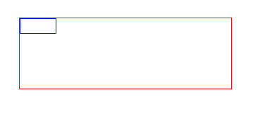
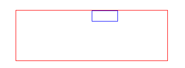
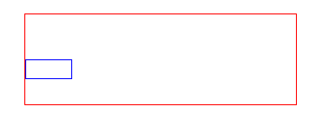

margin，元素的外边距，规定了元素与元素之间的间距，一直以来都是这么用的

margin: 10px 20px 15px 30px; 定义上右下左的边距

margin:0 auto; 定义居中

直到最近发现它和width,height什么的属性一样，也可以设置百分比。那这个百分比是相对谁的呢？


​    
```html
<!doctype html>
<html lang="en">
	<head>
		<title>Document</title>
		<style>
			.container{
				width: 500px;
				height: 300px;
				border: 1px solid red;
				margin: 30px auto;
			}
			.content{
				width: 100px;
				height: 50px;
				border: 1px solid blue;
			}
		</style>
	</head>
	<body>
		<div class="container">
			<div class="content"></div>
		</div>
	</body>
</html>
```


效果如下



  蓝色div没加margin属性，现在加上margin属性看看效果：margin-left: 50%;



显然左边距是父元素宽度的50%

现在尝试margin-top: 50%;  


显然上边距的距离依然是父元素宽度的50%;

也就是说百分比是相对父元素的宽而言的，不管水平方向还是垂直方向。

那如何让其相对父元素的高度来计算呢

给父元素加上 -webkit-writing-mode: vertical-lr;更改其书写方向，关于writing-mode的用法，这里不作叙述，有兴趣参照[css参考手册](http://css.doyoe.com/)中 “属性” -> “书写模式”  



明显，此时百分比是按照父元素高度来计算的，只是此时父元素的书写模式已改为竖直方向。

  

