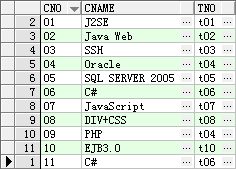

在维护代码的时候，看见merge into语句，遂查询记录如下。

在往数据库里保存数据的时候时常会遇到这种情况。如果一条记录已经存在，则更新相应的记录，如果不存在则插入这条新的记录。这时候就可以使用这个merge
into来进行操作。至于如何判断一条记录是否存在，可以自己定义对应的判断条件。

其基本语法如下

merge into 表名 表别名 using 表名 表别名 on 条件

when matched then update .........

when not matched then insert.........

下面实际操作来看一下。

有如下表


对此表进行如下merge操作


​    
```sql
MERGE INTO COURSE C 
USING (SELECT C.CNO+5 as CNO,C.CNAME,C.TNO FROM COURSE C) NEWC 
ON(C.CNO = NEWC.CNO) 
WHEN MATCHED THEN 
    UPDATE SET C.TNO=NEWC.TNO 
WHEN NOT MATCHED THEN 
    INSERT VALUES(NEWC.CNO,NEWC.CNAME,NEWC.TNO)
```

先看第二行using部分，这里是从原表选取数据，如果有其他表，当然可以换成其他表，这里不再建其他表，直接使用原表。在using后面的括号里面所选取出来的数据如下   


此表命名为NEWC。将会用此表往原表merge，也就是SQL文merge into后面写的那张表course。

下面就要判断条件，判断NEWC中的记录是否已经存在。判断条件就是用ON关键字来提示的。这里的条件是  
C.CNO = NEWC.CNO，也就是说如果原表C中已经存在相应的CNO的记录，表示该记录已经存在。对比发现CNO为6～10的记录在原表已经存在，
表示匹配，也是就matched，执行update子句，而cno为11～15的记录不存在，也就是not matched，执行insert子句。

执行结果如下。  


发现原来06～10的记录TNO字段被更新，并且新插入了CNO为11～15的记录。

当然在merge的时候，可以只选用update不用insert，或者只选用insert不用update。这里不再举例。

这是merge最基本的用法了，当然如果愿意，可以在update或者insert后面添加where判断，只更新或者只插入满足where条件的记录，

将表恢复至原来状态，修改上面的SQL如下。


​    
```sql
MERGE INTO COURSE C 
USING (SELECT C.CNO+5 as CNO,C.CNAME,C.TNO FROM COURSE C) NEWC 
ON(C.CNO = NEWC.CNO) 
WHEN MATCHED THEN 
    UPDATE SET C.TNO=NEWC.TNO 
        WHERE C.CNAME='PHP'
WHEN NOT MATCHED THEN 
    INSERT VALUES(NEWC.CNO,NEWC.CNAME,NEWC.TNO) 
        WHERE NEWC.CNO<'12'
```

所得结果如下



对比发现，并不想第一条SQL那样，现在只更新了CNO为09的记录，也就是CNAME为PHP的记录。插入的时候只插入了CNO为11的记录，满足条件CNO<12。

在使用insert的时候，可以只插入部分字段，写法如下

INSERT(CNO, TNO) VALUES(NEWC.CNO, NEWC.TNO)

这样得到的结果就是插入记录的时候只插入CNO和TNO字段的值，而CNAME将会为空。具体不再演示。

在update后面还可配合delete语句，在更新的同时删除某些记录。

仍然把表回复原样，进行如下操作。


​    
```sql
MERGE INTO COURSE C 
USING (SELECT C.CNO+5 as CNO,C.CNAME,C.TNO FROM COURSE C) NEWC 
ON(C.CNO = NEWC.CNO) 
WHEN MATCHED THEN 
UPDATE SET C.TNO=NEWC.TNO 
DELETE WHERE C.CNO>'09'
```

所得结果如下  


对比发现，CNO为06～09的记录被更新，原有的CNO为10的记录被删除。

这里被删除记录不仅要满足DELETE关键字后面的where条件，还要满足ON关键字后面的条件，还要满足UPDATE后面where条件。

对原始表如下操作


​    
```sql
MERGE INTO COURSE C 
USING (SELECT C.CNO+5 as CNO,C.CNAME,C.TNO FROM COURSE C) NEWC 
ON(C.CNO = NEWC.CNO)
WHEN MATCHED THEN 
    UPDATE SET C.TNO=NEWC.TNO WHERE C.CNO>'06' 
    DELETE WHERE C.CNAME='C#'
```

  

所得结果如下  


对比发现只更新CNO为06～10的记录，符合update语句后面的where条件，然而并没有删除CNAME为'C#'的记录原因是该条记录不满足update语句后面的where条件。

merge into的用法大致记录如上，有待后面实际的应用

