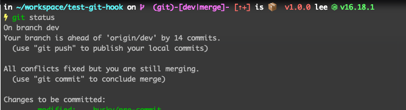

项目代码风格，一般会在 git 的 pre-commit 这个 hook 中进行代码风格的校验，如果校验失败将阻止本次代码的提交。需要将不符合规范的所有问题代码全部修复才能重新提交成功。

##  项目概况 

在我的项目里，使用的是 `eslint, prettier, lint-staged`来完成这些格式化及规范检查的，这也应该是前端项目最常用的两个工具了吧

由于这些校验工具是在项目中期引入的，代码需要修复的问题实在太多，一次性修复所有问题也是不太可能，所以在每次 commit 的时候，检测本次 commit 的文件。只能是改动哪个文件就修复掉哪个文件的问题吧。

##  问题 

在合并代码的时候，如果遇到有冲突的时候，在解决完冲突后需要重新 commit 代码，这时如果因为别人提交的代码并没有严格解决规范问题，将会导致自己无法正常提交代码，而是要将别人没解决的规范问题一起解决掉才可以正常 commit。这尼码有些坑爹啊，咱暴脾气瞬间就上来了好不好，就想杀了那些不按规矩来还自作聪明避开校验的程序员来祭天。

##  方案 

综合考虑之后，还是决定在正常修改代码后 commit 代码要触发校验。在 merge 之后的 commit 只触发代码格式化。而不作 eslint 的校验。

那要如何去检测本次 commit 是否是解决完冲突之后的 commit 呢，还是说是正常的 commit 呢。之前还真没有关注过 git 是否有哪条命令可以返回这样的状态。不过在执行 git status 命令的时候如果你 merge 示完成，也会有提示的，而且我电脑终端也会有状态提示。这就说明是有办法获取的状态的。



如上图所示我的终端是有明确提示的。

其实在 merge 冲突后, `.git/` 目录下会保存以下三个文件，`MERGE_HEAD`, `MERGE_MODE`, `MERGE_MSG`, **我们只要判断一下目录里是否存在这个 `MERGE_HEAD` 文件就知道是否处于 merge 状态了。**

##  解决 

项目的 git hooks 是通过husky 来写的，以下是 pre-commit 的内容

```shell
#!/usr/bin/env sh
. "$(dirname -- "$0")/_/husky.sh"

{
  git merge HEAD &> /dev/null
} || {
  echo "merge commit"
  # merge 后的 commit 仅执行 prettier 格式化
  npx lint-staged -c .lintstagedrc.prettier.yml
  exit 0
}

# 正常 commit 执行 eslint 和 prettier 格式化
npx lint-staged
```

 这里我们并没有采用判断文件是否存在的方式来判断 git 当前状态，而且通过尝试对自己进行 merge 的方式来判断状态

`git merge HEAD` 是在当前仓库对自己执行 merge 操作，如果执行失败则表示当前已经处理 merge 状态，如果执行成功，由于是对自己进行 merge ，不会对仓库产生任何影响

添加 `&> /dev/null` 是为隐藏不必要的输出

由于项目用的 `husky`, 在pre-commit 中任何命令的出错都会导致进程直接退出，无法正常提交代码。所以需要使用 `command1 || command2` 这样格式的命令。类似于 `try...catch` 在 command1 执行失败的时候才会执行 command2
