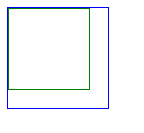
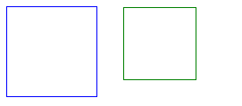
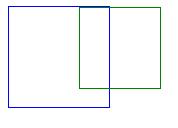

对mouseenter和mouseover这两个事件，以前都是在用到的时候，去试试，哪个这个不行，换另外一个，哪个满足要求用哪个，没去具体试过两者之间的区别，今天测试了一下，做如下记录


​    
```html
<div id="blue" class="blue">
    <div id="green" class="green"></div>
</div>
```


​    
```html
<style>
	.blue{
		height: 100px;
		width: 100px;
		border: 1px solid blue;
	}

	.green{
		height: 80px;
		width: 80px;
		border: 1px solid green;
	}
</style>
```


在浏览器中看到的是这样的


  


​    
```js
var blue = document.getElementById('blue'),
	green = document.getElementById('green');
```


​    
```js
blue.addEventListener('mouseenter', callback);
green.addEventListener('mouseenter', callback);

function callback (event) {
	console.log(event.target.getAttribute('id'));
	console.log(this.getAttribute('id'));
	console.log(event.type);
}
```


加上事件绑定后，当鼠标移入蓝框，未进入绿框时，触发蓝框的mouseenter事件，输出

blue

blue

mouseenter

继续移入绿框，触发绿框mouseeneter事件，输出

green

green

mouseenter

再从绿框移出进入蓝框时，没有反应

现在换成mouseover事件看看，

进入蓝框时输出

blue

blue

mouseover

继续移入绿框，触发绿框mouseover事件，输出

green  
green  
mouseover  
green  
blue  
mouseover

看到不仅触发绿框, 还冒泡触发了蓝框的mouseover事件，

当鼠标从绿框进入蓝框时，又触发蓝框的mouseover事件

blue

blue

mouseover

可以看到，鼠标进入子元素时，会触发子元素的mouseover，mouseenter事件，同时冒泡触发父元素的mouseover事件，但是不会冒泡触发父元素的mouseenter事件

接下来给绿框加上 margin-left: 130px;

这是两框位置如下


  
看到绿框已经到蓝框外面了，此时再看看事件的触发，

鼠标移入绿框

输出

green

green

mouseenter

blue

blue

mouseenter

可以看看不仅触发了绿框的mouseenter事件，外层蓝框的mouseenter事件也触发了，但是细看看，这好像不是通过冒泡来触发外层蓝框的mouseenter的。因为在蓝框的mouseenter回调函数中target和this都是外层蓝框。在callback函数中加上event.stopPropagation()，企图阻止冒泡，希望不要触发蓝框的mouseenter，发现并不管用，所以蓝框的mouseenter事件的触发并不是冒泡。

发现内部的div和外部div的相对位置对mouseenter事件的触发是有影响的

将mouseenter换成mouseover试试

输出

green

green

mouseover

green

blue

mouseover

看到内外部div的mouseover事件都触发了，而且外部div的mouseover事件是由于事件冒泡引起的。

给callback加上event.stopPropagation()后再试，

发现只输出

green

green

mouseover

并没有触发外层div的mouseover事件。

如果绿框的margin为70px，在浏览器中位置如下  
  
鼠标从右往左先进入绿框，触发绿框的mouseenter事件，蓝框的mouseenter事件，鼠标继续左移进入交界以及完全进入蓝框，都不会再触发mouseenter事件。

此时再向右移进入两框交界的地方，会触发绿框的mouseenter事件，继续右移将不会触发事件

如果是mouseover事件，又会不一样。

鼠标从右往左移，进入绿框，触发绿框和蓝框的mouseover事件，继续左移，进入交界处不会触发事件，但是当完全进入蓝框将触发蓝框mouseover事件，因为在完全进入蓝框之前，鼠标一直over在绿框上，没有over在蓝框之上。

此时反向向右移，进入交界处触发绿框和蓝框的mouseover事件，继续右移，不再触发事件

总结：

鼠标进入子元素，触发子元素的mouseenter，此时是否触发父元素的mouseenter事件，取决于此时鼠标是否在父元素的范围内，而且触发父元素的mouseenter事件，不是冒泡，所以无法使用stopPropagation

鼠标进入子元素，触发子元素的mouseover事件，此时将会触发父元素的mouseover事件。如果愿意可以通过stopPropagation阻止冒泡。

mouseenter对应的mouseleave

mouseover对应的mouseout效果差不多，不作叙述

