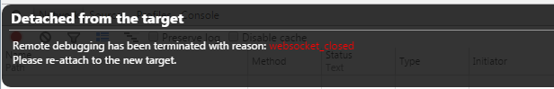
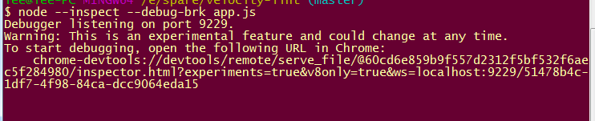

写Nodejs也不多，用debug就更不多了，平时的小问题，用log也就基本能解决了，但是最近遇到些问题需要进行debug详查，但是以前的debug方式却不能用了

以前偶尔debug一次，用node-inspector 进行debug，安装node-inspector

执行命令 ' node-inspector & '

然后以debug方式启动程序 node --debug-brk app.js

在chrome浏览器中访问debug的地址开始debug

可是今天debug的时候却行不通了，每次都是

后来查查，原因是我装nodejs版本高了，网上说是nodejs6.3以后就不能这样用了

现在再debug就不需要安装node-inspector了

现在按如下方式debug

执行命令

node --inspect --debug-brk app.js

执行后有如下输出

在chrome浏览器中访问上面的url

chrome-devtools://devtools/remote/serve_file/@60cd6e859b9f557d2312f5bf532f6aec5f284980/inspector.html?experiments=true&v8only=true&ws=localhost:9229/51478b4c-1df7-4f98-84ca-dcc9064eda15

就可以开始开心的debug了

