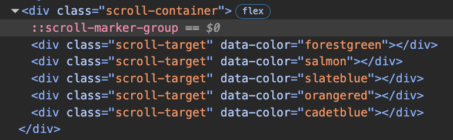
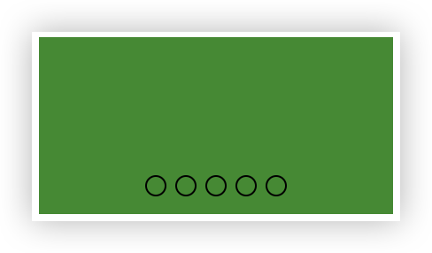
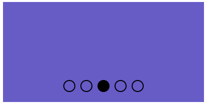

在开发轮播组件时，我们不仅要写每一屏的内容，还要写指示器的样式。每一屏都需要一个指示器，指示器的样式也需要写。还需要写指示器的点击事件，指示器数量还需要和内容的数量保持一致。

## scroll-marker-group
scroll-marker-group 属性用于标记是否在滚动容器内生成伪元素 `::scroll-marker-group`，以及生成的位置。

```html
<ul class="scroll-container">
  <li class="scroll-target"></li>
  <li class="scroll-target"></li>
  <li class="scroll-target"></li>
  <li class="scroll-target"></li>
  <li class="scroll-target"></li>
</ul>
```
应用下面的样式后，滚动容器内会生成伪元素 `::scroll-marker-group`。
```css
.scroll-container {
  --width: 200px;
  width: var(--width);
  aspect-ratio: 2;
  scroll-marker-group: after;
  display: flex;
  overflow: hidden;

  .scroll-target {
    width: var(--width);
    height: 100%;
    flex-shrink: 0;
    background-color: attr(data-color type(<color>));
  }
}
```



但是现在还没有指示器，如下图，我们需要写指示器的样式。


```css
.scroll-container {
  --width: 200px;
  width: var(--width);
  aspect-ratio: 2;
  scroll-marker-group: after;
  display: flex;
  overflow: hidden;
  scroll-behavior: smooth;
  anchor-name: --refer;

  &::scroll-marker-group {
    display: flex;
    gap: 5px;
    position: absolute;
    position-anchor: --refer;
    bottom: calc(anchor(bottom) + 10px);
    justify-self: anchor-center;
  }

  .scroll-target {
    width: var(--width);
    height: 100%;
    flex-shrink: 0;
    background-color: attr(data-color type(<color>));

    &::scroll-marker {
      content: "";
      width: 10px;
      height: 10px;
      border: 1px solid black;
      border-radius: 50%;
    }
  }
}
```
如下图，这样就在滚动容器内下部边缘生成了指示器，且点击指示器可以滚动到对应的内容。是不是特别方便



但是这样的指示器无法看出来当前显示的是哪一个内容，我们需要通过`:target-current`伪类来标记当前显示的内容,添加特殊样式
```css
.scroll-target::scroll-marker:target-current {
  background-color: black;
}
```
如下图，这样就可以看到当前显示的是哪一个内容了。



> 除了上面提到的`::scroll-marker-group` 和 `::scroll-marker` 还有`::scroll-button` 属性，它可以生成按钮，是轮播组件的上一个下一个按钮。这样就可以不需要写指示器。就不展示了

---

文中除了scroll相关的，还用到`anchor`及`attr`。感兴趣的可以留言讨论