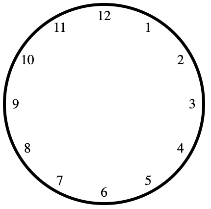

如果你需要画一个时钟表盘，你会怎么做？用12个div元素，使用CSS的`transform`属性来旋转它们，来将他们放在正确的位置。但是，你会发现，你需要使用JavaScript来计算每个div元素的旋转角度, 当前你也可以提前计算好，但终究是要计算的。一但钟表半径变化，你就需要重新计算。

那如何我们现在添加一些限制条件呢

```html
<div class="panel">
  <div class="digit"></div>
  <div class="digit"></div>
  <div class="digit"></div>
  <div class="digit"></div>
  <div class="digit"></div>
  <div class="digit"></div>
  <div class="digit"></div>
  <div class="digit"></div>
  <div class="digit"></div>
  <div class="digit"></div>
  <div class="digit"></div>
  <div class="digit"></div>
</div>
```
使用上面的html片段，不使用`nth-*`之类的选择器，不使用`+`选择器。纯CSS应该如何实现一个表盘呢

先添加一些基础样式
```css
.panel {
  width: 200px;
  height: 200px;
  border-radius: 50%;
  border: 3px solid #000;
  position: relative;
}
.digit {
  position: absolute;
  left: 90px;
  top: 90px;
  width: 20px;
  height: 20px;
  display: flex;
  justify-content: center;
  align-items: center;
  font-size: 14px;
}
```

## 填充12个刻度
再没有JS的情况下，我们可以使用`::after`伪元素来实现向页面添加显示内容。那1-12这些数字应该实现如何呢。在html中有什么情况会自动为元素填充序号呢？没错，有序列表。那我们这里其实也类似，在CSS中有`counter`功能

```css
.panel {
  counter-reset: digit;
}
.digit {
  counter-increment: digit;

  &::after {
    content: counter(digit);
  }
}
```
这样每个div中都会显示一个数字。接下来，我们需要将这些数字旋转到正确的位置。我们可以使用`transform`属性来实现。问题是，我们如何知道每个数字的旋转角度呢？我们可以使用`sibling-index`函数来实现。这个函数可以返回一个元素在兄弟元素当中的索引。我们可以使用这个函数来计算每个数字的旋转角度。

```css
.digit {
  --angle: calc((sibling-index() - 3) * 30deg);
  transform: translate(calc(cos(var(--angle)) * 90px), calc(sin(var(--angle)) * 90px));
}
```

附上完整代码
```html
<style>
  .panel {
    width: 200px;
    height: 200px;
    border-radius: 50%;
    border: 3px solid #000;
    position: relative;

    counter-reset: digit;
  }

  .digit {
    position: absolute;
    left: 90px;
    top: 90px;
    width: 20px;
    height: 20px;
    display: flex;
    justify-content: center;
    align-items: center;
    font-size: 14px;

    counter-increment: digit;

    --angle: calc((sibling-index() - 3) * 30deg);
    transform: translate(calc(cos(var(--angle)) * 90px), calc(sin(var(--angle)) * 90px));

    &::after {
      content: counter(digit);
    }
  }
</style>

<div class="panel">
  <div class="digit"></div>
  <div class="digit"></div>
  <div class="digit"></div>
  <div class="digit"></div>
  <div class="digit"></div>
  <div class="digit"></div>
  <div class="digit"></div>
  <div class="digit"></div>
  <div class="digit"></div>
  <div class="digit"></div>
  <div class="digit"></div>
  <div class="digit"></div>
</div>

```

效果如下


## 兼容性
目前只有chrome最新版本支持这个函数，其他浏览器还没有支持。谨慎使用
