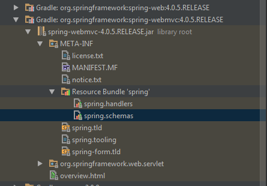

自从转前端开始，已经有好久没有写后端代码了，然而近来不得已，还是要触碰Java，没办法就当复习吧。看到spring的配置文件，尤其是头部那一堆，当年就特别晕乎，也没研究过，直接从别人的项目中copy一份就好了。也没有当回事，这次就花了点时间看看吧，做个记录，可能，也许，大概以后也不会用到吧。

先看个现有的文件是什么样吧


​    
```xml
<?xml version="1.0" encoding="UTF-8"?>
<beans xmlns="http://www.springframework.org/schema/beans"
        xmlns:xsi="http://www.w3.org/2001/XMLSchema-instance"
        xmlns:context="http://www.springframework.org/schema/context"
        xmlns:mvc="http://www.springframework.org/schema/mvc"
        xsi:schemaLocation="http://www.springframework.org/schema/beans
            http://www.springframework.org/schema/beans/spring-beans-4.0.xsd
            http://www.springframework.org/schema/context
            http://www.springframework.org/schema/context/spring-context-4.0.xsd
            http://www.springframework.org/schema/mvc
            http://www.springframework.org/schema/mvc/spring-mvc-4.0.xsd">
    
    <!--这里面是一些项目配置，以下是简单的几项配置-->
    
    <context:component-scan base-package="com.hope.fax.*"/>

    <bean class="org.springframework.web.servlet.mvc.method.annotation.RequestMappingHandlerAdapter">
        <property name="messageConverters">
            <list>
                <bean class="org.springframework.http.converter.json.MappingJackson2HttpMessageConverter"></bean>
            </list>
        </property>
    </bean>

    <mvc:annotation-driven></mvc:annotation-driven>
</beans>
```

首先第一行xml是声明，一个良好的xml文档应该有这样的声明

紧接着的一长串是命名空间的声明，不同的命名空间可能会声明相同的标签，所以使用标签的时候需要在一定的命名空间下，避免冲突。如代码中component-
scan这个标签就是mvc这个命名空间下的

那头部这堆要怎么写呢，总不能每次都去网上找个现成的，而且找到的也不一定合适

beans 是配置的根标签

xmlns：全称 xml namespace

xmlns:mvc 中的mvc就是给这个命名空间取的一个名字在使用到mvc下的标签时需要像


​    
```xml
<mvc:annotation-driven></mvc:annotation-driven>
```

这样添加mvc前缀

那下面这行没有取名的


​    
```xml
xmlns="http://www.springframework.org/schema/beans"
```

说的是默认命名空间，也就是说如果没有标签没有命名空间前缀，用的就是这个默认的命名空间，如文件中的根标签beans，bean，property等

xsi： 全称 xml schema instance。是用到的资源文件里定义元素所遵守的规范


​    
```xml
xmlns:xsi="http://www.w3.org/2001/XMLSchema-instance"
```

xsi:schemaLocation定义了本文档中要写元素所要遵守的规范，在IDE中可以提示标签使用是否合法

那么每个命名空间对应的网址要怎么写，记是记不住了，可以在对应的jar包中寻找


  

这里有个spring.schemas文件，内容如下


​    
```xml
http://www.springframework.org/schema/mvc/spring-mvc-3.0.xsd=org/springframework/web/servlet/config/spring-mvc-3.0.xsd
http://www.springframework.org/schema/mvc/spring-mvc-3.1.xsd=org/springframework/web/servlet/config/spring-mvc-3.1.xsd
http://www.springframework.org/schema/mvc/spring-mvc-3.2.xsd=org/springframework/web/servlet/config/spring-mvc-3.2.xsd
http://www.springframework.org/schema/mvc/spring-mvc-4.0.xsd=org/springframework/web/servlet/config/spring-mvc-4.0.xsd
http://www.springframework.org/schema/mvc/spring-mvc.xsd=org/springframework/web/servlet/config/spring-mvc-4.0.xsd
```


从这里可以直接复制你要的版本xsi:schemaLocation中是成对出现，空格分割如


​    
```xml
http://www.springframework.org/schema/mvc http://www.springframework.org/schema/mvc/spring-mvc-4.0.xsd
```

文档里面用到哪些命名空间，就引入哪些就好，没必要全部都引进来

