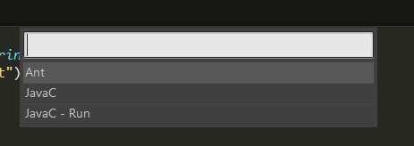
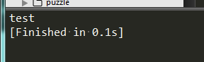

最近又用到了Java，有时候需要做点简单的测试，用惯了sublime，所以想在sublime运行Java

进入sublime安装目录 用压缩软件 打开 Package/Java.sublime-package

编辑内容如下

添加 variants


​    
```json
{
	"shell_cmd": "javac \"$file\"",
	"file_regex": "^(...*?):([0-9]*):?([0-9]*)",
	"selector": "source.java",
	"variants":[{
	    "name": "Run",
		"shell_cmd": "java \"$file_base_name\""
	}]
}
```


完成之后

只要 按快捷键 Ctrl + Shift + B 即可



选择JavaC 是编译， JavaC - Run 是运行



  

