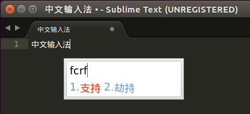
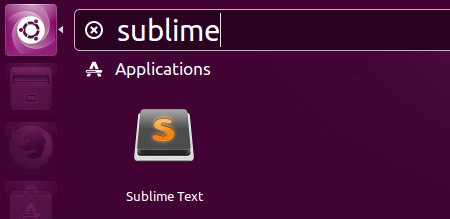

2015年最后一天，入职这段时间一直用的是ubuntu，以前一直用sublime开发，可是发现ubuntu上sublime不支持中文输入，在网上找了个方法，记录一下

将以下代码复制保存在 sublime_imfix.c 文件中


​    
```c
#include <gtk/gtkimcontext.h>
void gtk_im_context_set_client_window (GtkIMContext *context,
         GdkWindow    *window)
{
 GtkIMContextClass *klass;
 g_return_if_fail (GTK_IS_IM_CONTEXT (context));
 klass = GTK_IM_CONTEXT_GET_CLASS (context);
 if (klass->set_client_window)
   klass->set_client_window (context, window);
 g_object_set_data(G_OBJECT(context),"window",window);
 if(!GDK_IS_WINDOW (window))
   return;
 int width = gdk_window_get_width(window);
 int height = gdk_window_get_height(window);
 if(width != 0 && height !=0)
   gtk_im_context_focus_in(context);
}
```

在 sublime_imfix.c 所在目录执行以下命令


​    
```bash
gcc -shared -o libsublime-imfix.so sublime_imfix.c  `pkg-config --libs --cflags gtk+-2.0` -fPIC
```

执行命令前需要安装依赖


​    
```bash
sudo apt-get install build-essential
sudo apt-get install libgtk2.0-dev
```

这时会生成 libsublime-imfix.so 文件

将 libsublime-imfix.so 文件复制到sublime安装目录下，我的sublime安装在/opt/sublime_text

修改文件 /usr/bin/subl

将


​    
```shell
#!/bin/sh
exec /opt/sublime_text/sublime_text "$@"
```


改为


​    
```shell
#!/bin/sh
LD_PRELOAD=/opt/sublime_text/libsublime-imfix.so exec /opt/sublime_text/sublime_text "$@"
```


此时在命令行执行 subl 启动sublime即可输入中文


  

此时如果在


  

如果不通过命令启动，而是通过启动图标启动，依然不能输入中文

修改 /usr/share/applications/sublime_text.desktop

将[Desktop Entry]中的字符串

Exec=/opt/sublime_text/sublime_text %F

修改为

Exec=bash -c "LD_PRELOAD=/opt/sublime_text/libsublime-imfix.so exec
/opt/sublime_text/sublime_text %F"

将[Desktop Action Window]中的字符串

Exec=/opt/sublime_text/sublime_text -n

修改为

Exec=bash -c "LD_PRELOAD=/opt/sublime_text/libsublime-imfix.so exec
/opt/sublime_text/sublime_text -n"

将[Desktop Action Document]中的字符串

Exec=/opt/sublime_text/sublime_text --command new_file

修改为

Exec=bash -c "LD_PRELOAD=/opt/sublime_text/libsublime-imfix.so exec
/opt/sublime_text/sublime_text --command new_file"

好了，通过 启动图标启动也可以中文输入了

