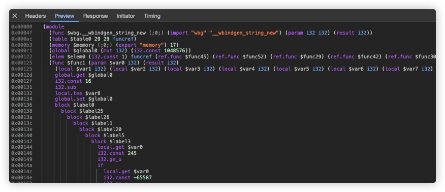

首先这篇文章不是讲如何逆向 wasm 文件，获取其内部逻辑，这个标签真的就是一个问题，想要问问是否可以逆向


## 编写一个 wasm

下面先演示用 rust 编写构建一个 wasm 的过程。rust 环境的安装，cargo 是什么命令就不解释了，官方网站有安装使用说明


1. 首先需要创建一个工程

   ```shell
   $ cargo new --lib greet-wasm
   ```

2. 进入工程目录添加依赖项

   ```toml
   [lib]
   crate-type = ["cdylib"]
   
   [dependencies]
   wasm-bindgen = "0.2"
   js-sys = "0.3.61"
   
   ```

3. 清空 `src/lib.rs` 文件中的内容，输入以下代码

   ```rust
   extern crate wasm_bindgen;
   
   use wasm_bindgen::prelude::*;
   
   #[wasm_bindgen]
   pub fn hello(input: &str) -> JsValue {
       JsValue::from_str(&format!("Hello {}!", input))
   }
   ```

4. 执行打包命令

   ```shell
   wasm-pack build  --target web
   ```

   经过打包后，将生成 `pkg` 目录, 此时已经可以将目录发布到 npm 仓库，供项目使用了，此处本地引用，就不发布了

5. 在网页中引用wasm

   新 html 文件并，并引用 hello 方法

   ```html
   <!DOCTYPE html>
   <html lang="en">
   <head>
     <meta charset="UTF-8">
     <meta http-equiv="X-UA-Compatible" content="IE=edge">
     <meta name="viewport" content="width=device-width, initial-scale=1.0">
     <title>Document</title>
   </head>
   <body>
     <script type="module">
       import init, {hello} from './greet-wasm/pkg/greet_wasm.js';
       async function run() {
         await init()
         console.log(hello('world'));
       }
       run()
     </script>
   </body>
   </html>
   ```

   使用任何静态资源服务器打开 html 文件，控制台将会成功打印 **Hello world!**， 到此已成功调用 wasm 内方法并获取到返回值


## 逆向 wasm

如果你尝试去打印一个 wasm 暴露出来的方法，将会看到 `[native code]` ，wasm 直接暴露的方法被认为是原生的方法，不会打印原始代码。毕竟原始代码也不是 js 写的。如果尝试在控制直接查看 wasm 文件的内容，看到是下面的内容，一般人肯定是看不懂的



## 生成函数签名

所以我在想如果把项目的参数签名逻辑放在 wasm 中去实现，生成签名的过程中使用的 salt 也放在 wasm 中，这样是不是可以避免别人写脚本刷接口的尴尬了。下面是简单的 demo，类似于在浏览器网络面板中看到的每个接口的入参及生成好签名

<div id="sign_demo"></div>
<script type="module" src="./sign.js"></script>

-----

那下面的问题就是，这样的网站发布上线后，能否获取网站的验签逻辑，然后修改参数生成签名然后调用接口，以达到一些不可告人的小心思呢。如果你曾经干成过这事，能不能留下你的方法呢
