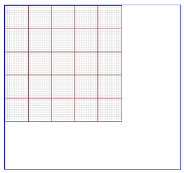
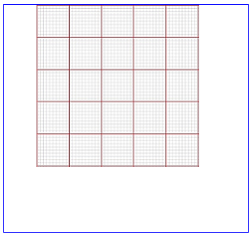
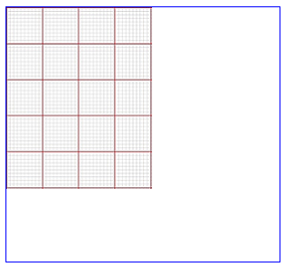
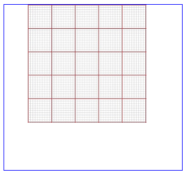
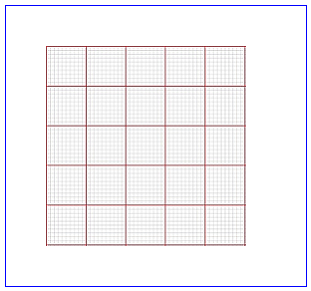

css里有个background-position 属性，用来设定背景图沿x ,y 方向的偏移量

可以设置像素值，百分比，或者固定的值,如top,bottom,center, left,right

下面例子中用的图片大小是200*200的，容器是300*280的

一般情况下设定 background-repeat: no-repeat 且 容器大于图片，图片位于左上角，如下图

  
此时如果设置：background-position-x:40px;

图片会向右偏移40px

  
如果设置为负数，则向左偏移，background-position-x: -40px;如下图

  
以上是设置固定像素值的情况，也可以设置百分比，设置百分比后,实际偏移量计算公式是

以X轴为例 偏移量 =（容器宽度 - 图像宽度）* 百分比

设置background-position-x:40%;

  
实际偏移量是(300 - 200)* 40% = 40px, 可以看到和直接设置background-position-x:40px效果一样。

如果设置top……等固定值，效果等同百分比具体如下

X方向：top=0%（上对齐）， center=50%（中对齐）， bottom=100%（下对齐）

Y方向：left=0%（左对齐）， center=50%（中对齐）， right=100%（右对齐）

以上只是X方向的例子，Y方向和X方向原理一样，正数向下偏移，负数向上偏移。

PS：当容器小于图片的时候，设置百分比时，正数百分比计算出来的值是负数，向负方向（左，上）偏移。

当容器和图片一样大小的时候，不论设置百分比为多少，最终得到的偏移量都为 0。

大部分情况下会使用background-position同时设置x,y方向，如果此时只设置一个值如 background-position:40px;
那么此值作用于X方向， Y方向被设为center，效果如下

  

