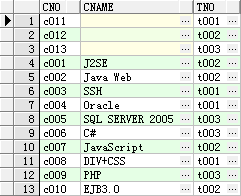
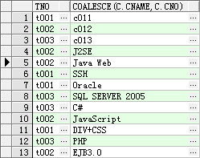
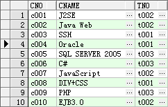
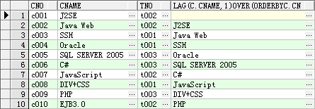
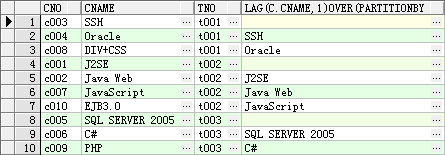
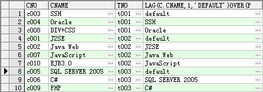

前段时间做维护的时候，阅读别人SQL文的时候看到几个函数，今记录如下，以备后用

1. COALESCE(expression_1,expression_2,……,expression_n)

   这个函数返回参数表达式中的一个不为空的表达式的值，如果所有表达式的值都为空，那么返回空。

   

   对这样一张表做如下SQL查询

   ```sql
   SELECT C.TNO,COALESCE(C.CNAME,C.CNO) FROM COURSE C
   ```

   得到如下结果

   

   当C.CNAME为空的时候显示C.CNO。当然如果这是CNO也是空值，那么将返回空值。

2. DECODE()

   该函数语法如下

   ```sql
   DECODE(expression, if1, value1, if2,value2, if3,value3, . . ., default)
   ```

   意思是说，如果expression的值等于if1的值，返回value1，如果不等，再和if2比较，相等返回value2，以此类推，如果所有的条件都不满足，返回default默认值。

   看下面SQL

   ```sql
   SELECT DECODE(1,1,'男',0,'女','未知') FROM DUAL  --1
   SELECT DECODE(0,1,'男',0,'女','未知') FROM DUAL  --2
   SELECT DECODE(3,1,'男',0,'女','未知') FROM DUAL  --3
   SELECT DECODE(3,1,'男',0,'女') FROM DUAL  --4
   ```

   第一条结果是"男"，第二条结果是"女"，第三条结果是"未知"，第四条结果为空。

   也就是说如果没有默认值，而前面的所有条件又都没有匹配，则返回空。

3. LAG()

   这个函数可以取出某个字段前N条记录的值。对如下表

   

   进行下面的SQL查询

   ```sql
   SELECT C.*,LAG(C.CNAME,1) OVER(ORDER BY C.CNO) FROM COURSE C
   ```

   所得结果如下

   

   第一条记录已经无法再取前一条记录，所以LAG()函数返回空。

   SQL为意思如下。

   LAG(C.CNAME, 1) 表示取前一条记录的CNAME的值。

   OVER(ORDER BY C.CNO)表示按CNO来排序，然后决定记录之间的前后关系。

   在over()里面还可以加入partition by，如下SQL

   ```sql
   SELECT C.*,LAG(C.CNAME,1) OVER(PARTITION BY C.TNO ORDER BY C.CNO) FROM COURSE C
   ```

   结果如下

   

   partition by是用来分区的。对TNO进行分区，在不同的TNO下寻找上一条记录的CNAME的值。所以查询结果中t001，t002，t003中分别有一条记录最后的值为空。

   如果希望在没有前N条记录的时候不返回空，可以使用默认值，SQL如下

   ```sql
   SELECT C.*,LAG(C.CNAME,1,'default') OVER(PARTITION BY C.TNO ORDER BY C.CNO) FROM COURSE C
   ```

   结果如下 

   

   在原来的空值的地方出现了default，当然这个值根据自己的需要设定想要的值。

   LEAD()函数与此类似，不过它是查询某字段的后N条记录的值。

   以上的SQL全部在oracle数据库下执行，其他数据库是否支持这些函数，未知，有待验证。

​	
