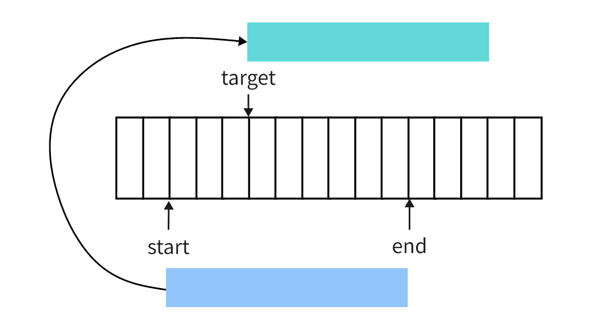
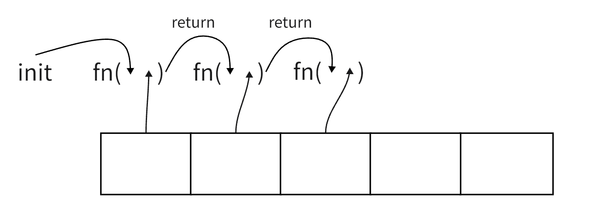
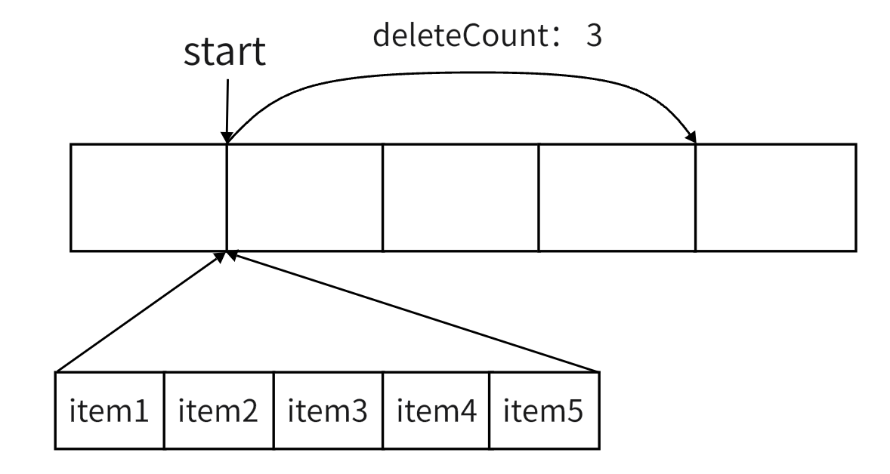

js 每年都会增加一些新特性，新方法。经常看见有些开发人员在处理数组时乱用方法，虽然最后功能实现了，但是那代码不忍直视。今天一篇文章带你梳理全部的数组方法


## Array

这是数组构造函数，用于创建一个新数组，接收一个或者多个参数

```js
new Array()    // []
new Array(4)   // [,,,,]   长度为4的数组，但是数组元素并不存在
new Array('4')  // ['4']   长度为1, 数组元素是字符串4
new Array(2, 3)   // [2, 3]  长度为参数长度，所有参数作为数组元素构建数组
new Array(undefined)  // [undefined]  长度为1， 元素是 undefined
```

> 总结起来就是:
>
> 当前没传参时，构建一个空数组
>
> 当只有一个参数 n，并且是数字时，构建一个长度为n的数组，并且这是一个稀疏数组，**何为稀疏数组，请接着往下看**
>
> 其余情况，构建一个长度为参数长度的数组，所有参数依次作为数组内的元素
>
> 当然我们可以不使用 new 来调用构造函数 `Array(4)` 这样少敲几下键盘，结果是一样的


## Array.from

从一个可迭代对象或类数组创建一个数组

```js
Array.from('hello') // ['h', 'e', 'l', 'l', 'o']
Array.from({length: 2})  // [undefined, undefined]
Array.from({length: 2}, (item, index) => index * 2) // [0, 2]  
Array.from(arrayLike, mapFunc, ctx)  // 在调用 mapFunc 时，使用 ctx 作为 this 对象
```

> 如果只有一个参数，使用这个参数的每一个迭代项组成新数组
>
> 如果有两个参数，使用参数一的每一个迭代项及对应序号作为参数调用参数二的函数，使用其返回值组成新数组。是不是有点像数组的 map方法。如果参数一是数组其实可以直接使用 map 得到映射数组，但如果是其它可迭代对象/类数组，则可以用上 Array.from 了


## Array.fromAsync

 这是一个异步版本的 Array.from 同样是从可迭代对象或者类数组创建一个新数组。不过这里迭代可以是 Promise，并使用的是 Promise 完成后的值作为数组元素。

```js
Array.fromAsync([Promise.resolve(1), Promise.resolve(2)], n => n ** 2)   // [1, 4]
```

> Array.fromAsync 本身返回的一个Promise 对象，上面的代码要获取数组，需要 then 或者 await 来搭配使用


## Array.isArray

判断给定参数是不是一个数组对象。这是最安全的方法

```js
Array.isArray([3])  // true
Array.isArray("ab")  // false
```

为什么说它是安全的，它是 js 内置方法，其判断并不依赖原型链，和 instanceof 不一样。请看下面的代码

```js
const m = [];
m.__proto__ = Set.prototype;
Array.isArray(m)  // true
m instanceof Array // false
m instanceof Set // true
// 改变了 m 原型，但是 Array.isArray 依然能判断出来它是一个数组
const n = {};
n.__proto__ = Array.prototype;
Array.isArray(n) // false
n instanceof Array // true
// 同样对象改变原型为数组的，依然可以识别到
const a = {};
a[Symbol.toStringTag] = 'Array'
Object.prototype.toString.call(a)  // [object Array]
Array.isArray(a)  // false
// 通过改变 toStringTag 的方式也可以识别
```

> 使用这个方法可以准确判断出在 js 里，它到底是不是真的数组。但是如果出现一些修改原型的妖孽，判断出是数组，但是却无法再调用原型上的数组方法，就很扯。*当然乱改原型的那个人应该被拉出来祭天*


## Array.of

也是根据参数创建数组，和Array构造有点像，只不过 Array 构造函数在只有一个数字作为参数时，会将其作为数组长度，Array.of 则不然，全部作为数组元素

```js
Array.of(3, 4) // [3, 4]  
Array.of(4) // [4]
Array(4)  // 长度为4的稀疏数组
```

> 话说用这玩意创建数组和下面的字面量有啥区别
>
> const arr = [3, 4];
>
> **所以它有没有其它的隐藏技能，知道的留言哈**


## Array[Symbol.species]

这是一个静态属性，平时基本用不到，在类继承时可能会要使用，但是已经有提案在研究要不要移除这个了，所以这里不展开了，感兴趣的可以自己去看看


## at

用于获取数组中某个元素，基本等价于[]，但是它支持负数，-1表示最后一个元素，-2是倒数第二个元素

```js
arr.at(-1) // 获取最后一个元素，再也不用像下面这样傻傻的先计算长度了 
arr[arr.length - 1]  // 获取最后一个元素
```


## concat

将多个数组拼接合并成一个数组，不改变原数组，返回一个新数组

```js
const arr1 = [1];
arr1.concat(2, [3, 4]) // [1, 2, 3, 4]
```

> 参数如果不是数组，参数作为数组元素，参数如果是数组，数组的每一项都作为新数组的元素

类数组是个对象，会作为一个整体添加到新数组中。如果希望它像一个普通数组一样展开，需要给类数组添加 `Symbol.isConcatSpreadable` 属性并设置为 `true`


## copyWithin

从数组中浅克隆一部分到当前数组的另一个位置，并不改变数组的长度, 函数有三个参数`copyWithin(target, start, end)`

功能及参数意义请参考下图



把 **start** 和 **end** 位置中的元素做一次浅备份，不改变原始数组。如图中蓝色区域，将取到的部分移动到绿色位置并对齐 **target** 位置，然后将绿色部分的元素从 target 位置开始，按顺序覆盖到原数组中去，如果绿色区域超长，多余的部分并不会添加到原始数组中。 这三个参数都支持负数。

```js
const arr = [9, 8, 7, 6, 5]
arr.copyWithin(1, 2)  // [9, 7, 6, 5, 5]  没传 end 表示浅备份一直到数组末尾
```


## keys

这个是不是经常看到这样的 `Object.keys(obj)`, 数组原型也有此方法，不过 Object.keys 返回的数组。而数组原型上的这个方法返回的是一个迭代器, 迭代内容则是原数组的索引

```js
const arr = ['a', 'b', 'c'];
[...arr.keys()] // [0, 1, 2]
```

> 有没有不懂迭代器的？


## values

和 keys 一样返回一个迭代器，迭代内容是数组元素

```js
const arr = ['a', 'b', 'c'];
[...arr.values()] // ['a', 'b', 'c']
```


## entries

同样是返回一个迭代器，迭代内容是下标和值组成的数组

```js
const arr = ['a', 'b', 'c'];
[...arr.entries()]  // [[0, 'a'], [1, 'b'], [2, 'c']]  结果和 Object.entries 很类似，key 是数组下标，value 下标对应的元素
```


## fill

使用某个值对数组中的某个区域进行填充，其语法是 `fill(value, start, end)`

```js
[1,2,3,5,6].fill(7, 1, 3)  // [1, 7, 7, 5, 6]   将数组下标从1到3（不包含）位置上的元素全部换成7

const k = Array(2).fill({a: 34})
k[0].a = 45
k[1].a  // 45
k[0] === k[1] // true
```

> 使用 fill 填充时，填充的是同一个对象，所以改变数组第一个元素 a 属性，事实上也就是改了第二个元素的属性。因为他们根本就是同一个对象


## every

测试数组中每一项是不是都能令指定的函数返回真值。其语法是 `every(fn, ctx)`

```js
[1,2,3].every(a => a > 0)  // true 数组中每一项都满足 大于0 这个条件
```

对数组中的元素按顺序调用函数 fn, 函数接收三个参数，**数组中的元素，元素下标，数组本身**。

ctx 是执行函数 fn 时候的 this 对象, 如无必要可以不传

> 如果数组是空数组，得到的结果是 true


## some

测试数组中能否有一项令指定的函数返回真值。其语法是 `some(fn, ctx)`

```js
[1,2,3].some(a => a > 2)  // true 数组中存3 大于 2
```

> 如果数组是空数组，得到的结果是 false


## forEach

使用每一项数组元素，元素下标，数组本身作为参数调用回调函数。forEach 本身没有有返回值，不产生新数组，功能相当于 for 循环

```js
var m = [1, 2];
m.forEach(n => console.log(n * 2))  // 控制台输出2, 4  并没有改变原数组
```

遍历过程中改变数组元素的某个属性

```js
const m = [{a: 3}, {a: 4}];
m.forEach(n => n.a *= 2)  // 控制台无输出，原数组变成 [{a: 6}, {a: 8}]
```

上面代码只是修改了某个元素的属性，但数组元素本身并不会改变

```js
const m = [{a: 3}, {a: 4}];
m.forEach((n, index, arr) => {
  if (index < 1) {
    n = index + 1;  // 不会修改原数组第0项
  } else {
    arr[index] = index + 2;  // 成功修改元素,
  }
})  
// 控制台无输出，原数组变成 [{a: 3}, 3]
```

**并不推荐在遍历过程中修改元素值，这可能会带来一些意想不到的结果**。除非你明确知道你要干什么，否则不推荐这么干


## filter

使用每一项数组元素，元素下标，数组本身作为参数调用回调函数，能使回调函数返回真值的数组元素会被过滤出来组成一个新的数组作为 filter 函数的返回值

```js
[1, 2, 3].filter(a => a > 2)  // [3]  这里的回调函数逻辑只用到了数组项，并没有使用到下标及数组本身。所以回调函数只定义了一个形参
```


## map

使用每一项数组元素，元素下标，数组本身作为参数调用回调函数，并将回调函数返回值组成一个新数组

```js
[2, 5].map(a => a ** 2)   // [4, 25]  每一项在回调函数中都经过平方运算后返回，所以结果数组的每一项都是原数组对应项的平方
```

如果并没有通过回调函数，将原数组项转化成别的内容，就不要使用 map 方法了

```js
let m = [{a: 3}, {a: 5}];
m = m.map((n, index) => ({...n, index}))  // 经常看到类似的代码，这样的逻辑直接使用 forEach 就好了，就别使用 map 了
// 改用 forEach
m.forEach((n, index) => n.index = index)  // 效果一样，同时 m 也可以使用 const 定义成常量
```


## reduce

很多人在提到这个方法，会脱口而出这是用来求和的。其实这也一个遍历方法，估计大多数文章在介绍这个方法的时候使用的例子都是求和，所以让不少人误解。这个遍历函数的回调函数 比其它遍历函数多了一个上一次运行结果。在使用某个元素调用回调函数的时候，会把上一个元素调用回调函数的结果一起传进去。文字讲起来是真费劲，看图吧



从图中可以很清楚的看到，在按数组元素顺序调用回调函数，每次调用都会把上一次调用的结果作为第一个参数传进去。最后调用回调函数返回的结果将作为 reduce 函数的返回结果

函数调用语法是`reduce(fn, init)`

**如果不提供 init 初始值，那么数组第一项将作为初始值，遍历从第二项开始**

reduce 方法有很多使用场景，最常见就是求和（是的，我也用求和举例）

```js
[1, 2, 3].reduce((acc, n) => acc + n, 0) // 6
```

然而它不仅仅能求和。求积不也可以么（哈哈，说了等于没说）。事实上，reduce 基本可以用来看看所有数组相关的处理。比如用 reduce来实现 filter 的功能

```js
[2, 1, 3].reduce((f, n) => n > 1 ? f.concat(n) : f, [])  // [2, 3] 所有大于1的元素都被过滤出来了
```

再比如我们有一个异步函数队列，需要在前一个异步函数拿到结果之后，将结果传递给下一个异步函数

```js
async function asyncfun(i) {console.log(i); return i + 1;};
const promise = [asyncfun, asyncfun, asyncfun].reduce((p, afun) => p.then(afun), Promise.resolve(1)) 
promise.then(console.log)   // 4  控制台会按顺序打印1, 2, 3 最后 promise 成功后打印4
```


## reduceRight

这个就不讲了，reduce 是从第一个元素开始依次向后调用，reduceRight 是从最后一个元素依次往后调用


## indexOf

查找数组中第一次出现指定值的元素下标。如果不存在则返回-1， 可以指定从哪个位置开始查找。语法是`indexOf(target, fromIndex)`

其中 fromIndex 是支持负数的

```js
[1, 5].indexOf(5)  // 1
[2, 3, 4].indexOf(2, 1) // -1  // 虽然数组中包含2， 但是调用方法时指定了从下标1的位置开始查找，所以并没有查找到2
```


## lastIndexOf

和 indexOf 类似，只不过是从数组末尾往前查，查找最后一次出现指定值的索引

```js
[1, 5, 1].lastIndexOf(1)  // 2
[2, 3, 4].lastIndexOf(4, 1) // -1  // 虽然数组中包含5， 但是调用方法时指定了从下标1的位置开始查找，所以并没有查找到5
```


## find

查找第一个让回调函数返回真值的数组元素，并返回这个数组项，如果所有的元素都不符合要求，返回 null

```  js
[1, 2, 3, 4].find(a => a > 2)  // 3
```


## findIndex

和 **find** 类似查找第一个让回调函数返回真值的数组元素，但这里返回的是对应的下标。如果所有元素都不符合要求，返回 -1

```js
[1, 2, 3, 4].find(a => a > 2)  // 2
```


## findLast

和 **find** 类似，但是是从数组最后一个元素查找，相当于查找最后一个让回调函数返回真值的数组元素， 找不到则返回 undefined

```js
[1, 2, 3, 4].findLast(a => a > 2)  // 4
```


## findLastIndex

和 **findLast** 类似，不过返回的是元素下标，找不到返回 -1

```js
[1, 2, 3, 4].findLastIndex(a => a > 2)  // 3
```


## flat

将数组元素按顺序全部拼接在一个新数组中，如果参数大于0， 如果数组元素仍然是数组，则元素展开后再拼接到结果数组中。这过程也叫数组扁平化。**在此过程中，会忽略稀疏数组中的空白位置**

``` js
[1, [2, 5]].flat(0) // [1, [2, 5]]  没有拍平过程，功能有点类似于 [...arr]
[1, [2, 5]].flat() // [1, 2, 5] 默认是1， 只展开一层
[1, [2, [3, 4, [5]]]].flat(2) // [1, 2, 3, 4, [5]] 只展开两层， [5] 属于嵌套第三层，没有展开
```


## flatMap

将数组通过回调函数的结果，映射为新数组，同时再展开一层。将相当于 `arr.map(fn).flat(1)`

```js
[1, [2, 5]].flatMap(n => typeof n === 'number' ? 2 * n : n) // [2, 2, 5] 数字元素变成两倍，其它不变，最后展开一层
```


## reverse

将数组逆序，会改变原数组，同时方法也有返回值，返回的就是原数组的引用。这可能是为了方便链式调用吧


## toReversed

数组逆序，但是不会改变原数组，返回一个新的逆序数组


## includes

判断数组中是否包含某个元素，并且可以指定从哪个下标开始查找，语法是 `includes(target, fromIndex)` 

其中 fromIndex 也是支持负数的

该方法的返回值是布尔类型 true / false

```js
[1, 5].includes(5)  // true
```

> 判断数组中元素是否和参数 target 相等时，用的既不是 ===的逻辑， 也不是Object.is 的逻辑。它在 Object.is 的基础上认为+0, -0 是相等的


## join

将数组中的元素，使用指定的连接符进行字符串拼接，并返回拼接好的字符串， 语法是 `join(sep)`

分割符默认是逗号（ , ）

```js
[1, 3, {}].join('-')  //  '1-3-[object Object]'  最后一个元素不是字符串，所以会先转成字符串再进行拼接
[1, 2, [4, 5, [7, 9]]].join('-') // '1-2-4,5,7,9' 元素如果也是数组，将会递归使用 join() 只不内部 join 默认使用逗号分割了
```


## pop

删除数组最后元素，并返回该元素，此方法会改变原数组。如果原数组为空，返回 undefined

```js
const m = [1, 4, 3];
m.pop()  // 3, 经过此 pop 操作过，原数组 m 变成[1, 4]
```


## push

在数组末尾添加一个元素，返回添加后的数组长度, 此方法会改变原数组

```js
const m = [1, 2]
m.push(6)  // 3 经过 push 操作后，原数组 m 变成 [1, 2, 6]
```


## shift

移除数组第一个元素，并返回该元素，此方法会改变原数组。如果原数组为空，返回 undefined

```js
const m = [1, 4, 3];
m.shift()  // 1, 经过此 pop 操作过，原数组 m 变成[4, 3]
```


## unshift

在数组开始位置插入一个元素, 返回插入数值


## slice

原数组指定下标区间的元素的浅拷贝，此方法不改变原数组。语法是`slice(start, end)`

如果不传参数表示整个数组的浅拷贝

如果不传 end 表示从开始位置一直到数组末尾的浅拷贝

```js
const m = [1,2,3,4,5]
m.slice()   // [1,2,3,4,5]
m.slice(2)  // [3,4,5]
m.slice(2, 4) // [3, 4]
```


## splice

此方法可以说是对数组进行增删的终极方案，pop,push,shift,unshift 只能在头部或者尾部进行操作，而 splice 方法可以在任何位置，其语法是 `splice(start, deleteCount, ...items)` 其含义是从 start 位置开始，删掉deleteCount个元素，然后在 start 这个位置开始插入后面所有的items。 deleteCount 为0表示没有插队，items 如果没有，表示只删除没有新增的元素。该方法返回一个数组，数组元素就是从原数组中移除的元素



```js
const m = [1,2,3,4,5]
m.splice(1,2,6,7) // 方法返回[2,3]  原数组 m 变成 [1, 6, 7, 4, 5]
```


## toSpliced

和 splice 逻辑基本一样，区别是此方法不改变原数组，且返回是操作后生成的新数组，不是被删除的部分元素

```js
const m = [1,2,3,4,5]
m.toSpliced(1,2,6,7) // 方法返回[1, 6, 7, 4, 5]  原数组 m 不变
```


## sort

对数组元素进行排序，此方法改变原数组，方法返回原数组的引用。应该是方便链式调用。默认排序是将原数组转换成字符串然后按字符进行升序排列。如果需要自定义排序逻辑，需要自定义排序函数

```js
[1, 4, 12].sort()  // [1, 12, 4]   按照字符顺序排列，12 要比 4 小
[4, 1, 12].sort((a, b) => a - b)  // [1, 4, 12]  
```

在提供排序函数的情况下，sort 方法会根据排序函数的返回值对 a, b 进行排序

| 排序函数返回值           | a,b顺序               |
| ------------------------ | --------------------- |
| > 0                      | a 在 b 后面           |
| < 0                      | a 在 b 前面           |
| === 0（NaN 被当作0处理） | a 和 b 的顺序保持不变 |

> 有没有感觉上面这个排序逻辑很难记，尤其是涉及到多字段排序，先根据一个字段升序排序，如果相同再根据另一个字段降序，写这样排序的时候有没有心碎， 这里推荐一个更简单的排序书写方法。要引入 [yatter](https://www.npmjs.com/package/yatter) 这个库，里面提供了一些日常使用的功能函数

```js
import {sorter} from 'yatter';
// 这个 sorter 其实是用来帮我们创建排序函数的，我们只要告诉它根据什么排序，是升序还是降序
[4, 12, 1].sort(sorter(a => [a], 'desc'))  // [12, 4, 1]  函数 a => [a]  就是在说根据元素本身排序，'desc' 标记是降序
// 复杂一点点的，根据年龄了降序，年龄相同的，女生排前面，男生排序后面
const users = [{age: 23, gender: '男'}, {age: 23, gender: '女'}, {age: 25, gender: '男'}]
users.sort(sorter(a => [a.age, Number(a.gender === '男')], ['desc', 'asc']))
// sorter 的回调函数 返回 [a.age, Number(a.gender === '男')] 此时男生转换成1， 女生转换成0进行排序，女生排前面，所以是升序 
// 再结合sorter第二个参数['desc', 'asc'], 此排序逻辑就是先年龄降序，再性别升序（也就是要求的女生在前）

// sorter 方法第一个参数就是帮我们把数组每个元素转换成可排序的值，以数组形式返回，第二个参数指定这些字段排序方向，如果所以字段的排序 方向都一样，可以使用字符串，否则使用数组形式
```


## toSorted

原 sort 相似，但此方法不改变原数组，将产生一个新数组，返回排序后的结果 


## toLocaleString

将数组元素每个元素都调用自己的 toLocaleString, 然后根据使用语言环境，使用特定的分割符将元素拼接起来，这个方法一般的项目还真不怎么会用到


## toString

其实就是 join(), 使用逗号将元素拼接成字符串


## with

此方法将产生一个新数组，指定位置的元素使用新值替换，其它位置元素和原数组一致。

语法是 `with(index, value)` 

相比使用[]去修改值，with 可以做到链式调用

```js
const m = [3,4,5]
m.with(1, 7)   // 返回新数组 [3, 7, 5]  原数组保持不变
```

**如果原数组是稀疏数组，with 方法会使用 undefined 填充空白部分。所以 with方法永远不会返回稀疏数组**


----


## 稀疏数组

上面多次提到稀疏数组，初学者可能不太明白什么稀疏数组。说白了，就是空有长度，但是某些下标并不存在。它不同于存在，值为 undefined。它是根本不存在。拿对象来举例

```js
const obj1 = {a: undefined};
const obj2 = {};
// 这两个对象读取 a 属性都是 undefined, 但是 obj1是的 a 属性是真实存在的，只不过值是 undefined, 而 obj2 直接是没有 a 属性
// 把对象换成数组，属性名换成数字，有属性不存在的就是稀疏数组
```

创建一个稀疏数组来验证一下

```js
const a = Array(4)  // 长度为4的稀疏数组
Object.hasOwn(a, 1)  // false    没有下标1
a[1] = 1   // 加进来了，并设置值
Object.hasOwn(a, 1)  // true   有这个下标了
Object.hasOwn(a, 2)  // false   下标2 依然不存在
```

> 稀疏数组对日常开发可能并没有太大影响，但是在使用遍历方法的时候，需要非常注意
>
> 在使用以下遍历方法的时候，会先使用 in 来判断对应下标是否存在，如果不存在将会跳过这个下标
>
> every, filter, flat, flatMap, forEach, map, reduce, reduceRight, some 

```js
Array(10).map((n, index) => index + 1)  
// 原本是想创建一个1到10的数组的，结果自然是失败的，Array(10)创建的是稀疏数组，map 回调函数一次也不会执行，最后结果还是稀疏数组
```


---


> 数组上的遍历的方法，其回调函数除 reduce，reduceRight 都是接收当前元素，元素下标，当前数组作为参数，reduce，reduceRight 是的回调函数参数是4个，第一个参数是上一次的运行结果，
