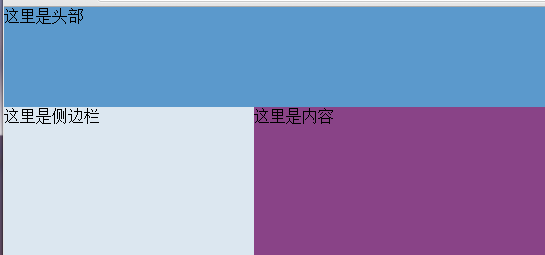

这是一个常用的布局，尤其是在管理系统中，要求头部高度固定，左侧宽度固定，内容区高度和宽度随浏览器窗口大小变化而变化并充满浏览器窗口右下角




之前都是用js实现的，在窗口大小变化时，去设置相关区域的宽度和高度

后来发现可以直接用css实现，主要用的是绝对定位，top, right, bottom,
left同时使用，关键是不能给内容区域设置宽度和高度，要不然绝对定位中的right或者bottom会不生效


​    
```html
<!DOCTYPE html>
<html lang="en">
<head>
    <meta charset="UTF-8">
    <title>Document</title>
    <style>
        html,body{
            padding: 0;
            margin: 0;
            height: 100%;
            overflow: hidden;
        }
        .container{
            height: 100%;
            width: 100%;
            position: relative;
        }
        .head{
            height: 100px;
            background: #5B99CC;
        }
        .side{
            height: 100%;
            background: #DCE7F0;
        }
        .content{
            background: #894387;
            position: absolute;
            top: 100px;
            bottom: 0;
            left: 250px;
            right: 0;
        }
    </style>
</head>
<body>
    <div class="container">
        <div class="head">这里是头部</div>
        <div class="side">这里是侧边栏</div>
        <div class="content">
            这里是内容
        </div>
    </div>
</body>
</html>
```

  


  