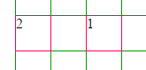
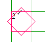
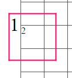
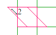
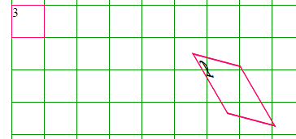
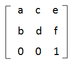
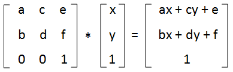
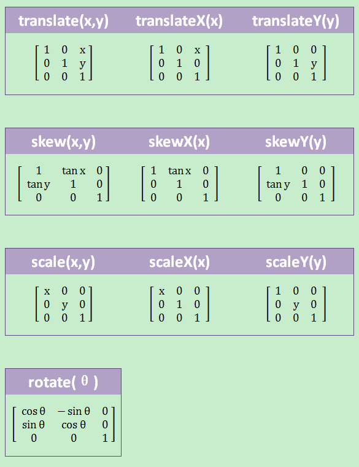

这两天有时间学习了一下css里面transfrom的matrix的用法，下面做个记录

css中transform是用来做变形的，支持rotate(旋转)，translate(偏移)，scale(伸缩)，skew(倾斜)，matrix(矩阵变换)，其中前四种的可以说是matrix的简化，只针对某一种变换，而且更容易理解。

先简单说一下rotate, translate, scale, skew

transform:translate(80px)



原本1和2重合在一起的,应用了上面的translate后向右偏移了80px

transform:rotate(45deg) 顺时针45°



transform:scale(2) 放大2倍  



transform:skew(45deg) 倾斜45°  



上面只是对translate，rotate，scale，skew几种的简单应用，更多可参考网上其它资料，比如scale设负数会翻转并进行伸缩

下面讲讲matrix

先看个例子



1,2,3div原本同样位置，


​    
```css
.m1{
    transform-origin: 0px 0px;
    transform:matrix(1.4488, 0.38820, 1.06060, 1.83700, 222.16290, 59.52840)
}
.m2{
    transform-origin: 0px 0px;
    transform: rotate(15deg) translateX(230px) scale(1.5) skewX(45deg);
}
```

1和2用的是不同的样式，结果是一样的matrix可以一次实现rotate, translate, scale, skew

下面看看怎么实现的

matrix有6个参数transform:matrix(a,b,c,d,e,f) 这里说的是2d变换，不考虑3d变换

网上不少文章做了解释如何用matrix实现rotate, translate, scale, skew。 如下

transform: matrix(1, 0, 0, 1, e, f) 表示 translate(e, f)x方向偏移e， y方向偏移f

transform: matrix(a, 0, 0, d, 0, 0) 表示 scale(a, d) x方向a倍，y方向b倍

transform: matrix(cosθ,sinθ,-sinθ,cosθ,0,0) 表示 rotate(θ) 旋转角度θ

transform: matrix(1,tanθ,tanβ,1,0,0) 表示 skew(β, θ) x方向倾斜β，y方向倾斜θ

那难道用matrix的时候只能按照这四种格式用么，那还有什么意义，直接用rotate……这些不就好了，简单易懂，看上面的例子就知道了，matrix可以同时实现rotate,
translate, scale, skew的

那在matrix中随便写参数如何变换，知道了rotate, translate, scale, skew如何写成matrix

先看matrix中随便写参数如何变换transform:matrix(a,b,c,d,e,f) ？

转换为矩阵如下



用这个矩阵乘以位置坐标(x，y)的矩阵，即可得到新位置坐标(ax+cy+e，bx+dy+f)



再看知道了rotate, translate, scale, skew如何写成matrix ？


​    
```css
transform: rotate(15deg) translateX(230px) scale(1.5) skewX(45deg)
```

是怎么转换成


​    
```css
transform:matrix(1.4488, 0.38820, 1.06060, 1.83700, 222.16290, 59.52840)
```

也很简单

用上面讲到的将roate(15deg) translateX(230px) scale(1.5)
skewX(45deg)分别转换为matrix，然后相乘，就可以得到结果

附一个rotate……到matrix的对应关系



如果对矩阵运算不熟悉，推荐 “云算子” 在线求解

