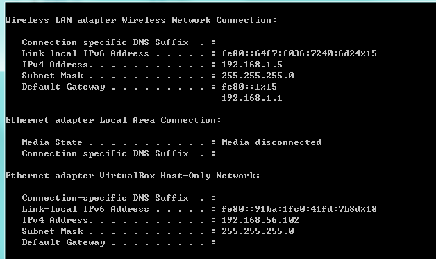

环境

宿主机： win7

虚拟机：VirtualBox Centos7

有时为了做测试，要在虚拟机上布署一个web服务，然后在本地宿主访问，这就要宿主机和虚拟机之间能够互相访问，为此要做如下设置

在虚拟机的设置中启用两块网卡如下图

第一个块网卡设置为Host-Only Adapter第二块网卡设置为NAT。此时查看宿主机的IP。命令ipconfig

Wireless LAN是我宿主机的无线网，而 VirtualBox Host-Only Network则是由虚拟机生成的

启动虚拟机。确保两个网卡都连接上

查看Centos的ip。命令 ifconfig。注意这里是ifconfig不是ipconfig

注意红框中的ip，一定要和在宿主机中看到virtualbox生成的那块网卡在一个网段下

现在在宿主机中 ping 192.168.56.103试试，是否能ping通

返过来，ping宿主机也是可以ping通的

如果都能ping通，但是却不能访问网页，要检查虚拟机中的防火墙设置，centos7默认用的是firewall

查看状态 systemctl status firewalld

如果是启动状态，可以停掉试试。sudo systemctl stop firewalld

或者用其自带的配置工具配置。命令： firewall-config，调用图形配置工具

===================================这是分割线======================================

突然发现上面的方法好复杂，其实只要将虚拟机设置为bridge模式即可

此时虚拟机网址应该和宿主机是一个网段下的

此时就可以互相访问对方起的服务了

虚拟机访问宿主机  

宿主机访问虚拟机  

  

