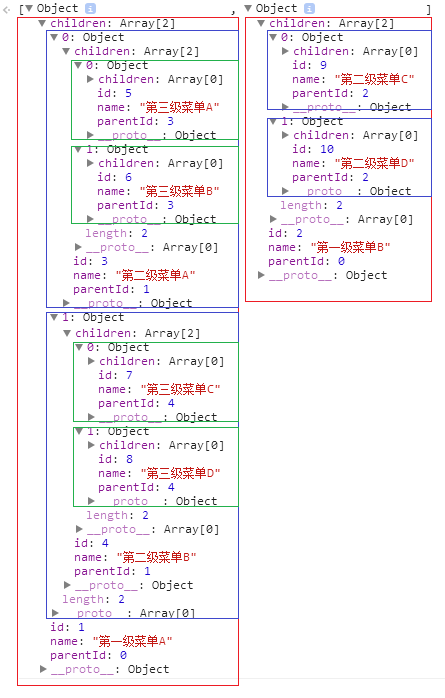

最近项目中遇到了将数组形式的菜单转化为树状结构的菜单

例如，原始数据是


​    
```json
[
    {id: 1,  parentId: 0, name: '第一级菜单A' },
    {id: 2,  parentId: 0, name: '第一级菜单B' },
    {id: 3,  parentId: 1, name: '第二级菜单A' },
    {id: 4,  parentId: 1, name: '第二级菜单B' },
    {id: 5,  parentId: 3, name: '第三级菜单A' },
    {id: 6,  parentId: 3, name: '第三级菜单B' },
    {id: 7,  parentId: 4, name: '第三级菜单C' },
    {id: 8,  parentId: 4, name: '第三级菜单D' },
    {id: 9,  parentId: 2, name: '第二级菜单C' },
    {id: 10, parentId: 2, name: '第二级菜单D' }
]
```

转化为




需求已经明确，现在就看是怎么实现的

两次对数组两次循环

第一次循环

找到所有第一级菜单放入数组A，其余的放入另一个数组B，并将所有菜单以id作为key放入一个对象C中,

第二次循环

对数组B循环，通过parentId到对象C中找到父级，并push到父级的children数组中。

通过这两次循环，已经转化完成，代码如下


​    
```js
function array2tree (arr) {
    var top = [], sub = [], arrObj = {};

    arr.forEach(function (item) {
        if (item.parentId === 0) {
            top.push(item);
        } else {
            sub.push(item);
        }
        item.children = [];
        arrObj[item.id] = item;
    });

    sub.forEach(function (item) {
        var parent = arrObj[item.parentId] || {'children': []};
        parent.children.push(item);
    });

    return top;
}
```

那么问题来了，能否通过一次循环就解决问题，答案是可以的

在循环过过程中将第一级菜单放入数组A，将所有菜单以id作为key放入对象B中，同时以parentId作为key在对象B中找到其父级，并将其push到父级的children中，在这一步需要注意的是，如果子级先出现，那么就有可能在对象B中找不到父级。所以这里要作点处理，具体如下

如果子级先出现，在对象B中找不到父级，这是要在对象B中创建一个对象作为临时的父级，并将子级push到这个临时的父级children中。当然这个子菜单也要放入对象B中

这是又会出现另外一个问题，当真正的父级出现时，对象B中已经存在一个临时的父级时，这时要作的处理是将临时的父级的属性扩展到真正的父级中，并用真正的父级替换对象B中的临时父级。

哈哈，真绕，看代码


​    
```js
function array2tree (arr) {
    var top = [], arrObj = {};

    arr.forEach(function (item) {
        var id = item.id, parentId = item.parentId, parent, own;
        if (parentId === 0) {
            top.push(item);
        }

        item.children = [];
        own = arrObj[id];
        if (own) {
            Object.keys(own).forEach(function (key) {
                item[key] = own[key];
            });
        }
        arrObj[id] = item;

        parent = arrObj[parentId];
        if (!parent) {
            parent = {'id': parentId, 'children': []};
            arrObj[parentId] = parent;
        }
        parent.children.push(item);

    });
    return top;
}
```

