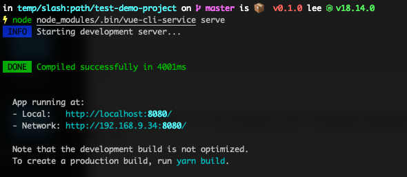

好好的一个前端项目突然启动不了了，这不是活见鬼了么？别人的电脑上正常，自动电脑上别的项目正常。唯独这一个项目有问题，这应该是玄学范畴了吧

## 错

直接看终端是如何提示的吧

提示没找到 `vue-cli-service` 这个命令，可是项目依赖已经安装成功了呀。不信？再看直接使用 node 执行对应的文件

看到了么，项目启动成功啊，可以直接通过`yarn serve` 却是报错了，说是项目配置错误吧，别人电脑上正常的很。说是环境问题吧，自己电脑上有别的项目也能启动成功。我也怀疑过是 node 版本的问题，可以换了版本也不行。

## 原因

眼尖的朋友已经看出来了，说你的项目路径中为什么有个`:` ，貌似和别人的不一样呢。你看着他是个冒号，其实他不是。看看它是什么

这尼码什么鬼，为什么目录会包含一个斜杠。这个符号不是用来路径分割的么？怎么可以在目录名中包含这个。所以为了区分在终端中看到的是一个`:`

------

问题是在 mac 机器上出现的，在别的系统上是否有相同的问题，并不确定，也没去试，毕竟 window系统的分割符是`\`，也不要问我为什么在命名目录的时候会输入`/` ， 我也不知道啊，也不是我创建的这个目录

