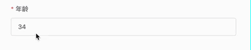

在浏览项目时，发现一个有意思的事情，就是表单校检的错误信息在失焦后就自动消失了。真是离谱到家了

可以看出来在输入数字时，不会有错误提示，如果没有任何输入，在失焦时会提示这项是必填的，**在输入一些特殊字符时，会立刻提示错误信息，但是在输入框失焦后这个错误信息又消失了**。

这个 demo 中使用了 vue2 + elementui。表单校检也是使用了 elementui 的表单校验。这个输入框一共添加了两个校验规则

- 必须项，trigger 为 blur
- 自定义检校，trigger 为 change

## 解决

原以为是 elementui 出问题，但想想不应该，elementui应该不至于出这种错误，以前也实现过其它的自定义校检，都没有问题的，怎么到了这就不一样了。查找问题的方式也很简单,一个字**删**。只保留必须项规则 ，或者自定义规则。结果发现在只有自定义规则的时候，失焦后错误信息并不会消失。**搞定，原因就是在失焦时候只校验必须项，结果发现有输入内容，校验通过，没有问题，所以清空错误信息**。解决方案就是自定义规则的触发时机改为 blur + change，或者两个规则都用 blur，或者都用 change

----

elementui 是不是应该把不同事件触发的校验结果保存在不同的变量上，相互不影响，有任何一个校验不通过，就显示对应的信息，当然显示其中一个就行。
