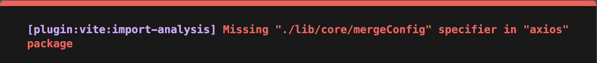

10月第一坑，节后上班第一天，就给整这么一出，同样的代码，在之前的项目运行正常，在新项目却出现页面打不开的问题


## 什么样的坑

先看项目报错吧，如下图



这个报错大概就是说在进行导入分析的时候，发现在 axios 包中并没有 `./lib/core/mergeConfig`

> 项目就是一个普通的 ts + vue3 的使用，使用 vite 构建， 用到了 axios

通过这个错误提示，基本可以锁定问题代码是项目的中使用了 axios 里的 mergeConfig 方法

```javascript
import mergeConfig from 'axios/lib/core/mergeConfig';
```

至于为什么要使用这个方法就不展开了，反正这段代码在之前的项目是可以使用的。在今天的这个项目就是不行。由报错信息来看，是 vite 插件中报出来的错，起初以为是 vite 版本的引起了，对比了一下，果然一个3.x版本，新项目是4.x版本，果然将新项目降级到3.x 版本试试看，然而并没有什么用。问题还是那个问题，


在网上也大致搜索了一下，没什么相似的问题及解决方案。真是头大


## 找原因

网上没找到答案就，自己找吧。首先明确的是在 axios 包目录下是有我所引用的文件的。那为什么引用不到呢？既然在 vite 环境下引用不到，那在纯node环境下是否可以呢。直接在终端上输入`node` 并回车进入 **REPL** 环境，输入以下代码

```javascript
var mergeConfig = require('axios/lib/core/mergeConfig');
```

执行代码，立马就发现问题原因了

> Error [ERR_PACKAGE_PATH_NOT_EXPORTED]: Package subpath './lib/core/mergeConfig' is not defined by "exports" in .../node_modules/axios/package.json

也就是说在 axios 包的 package.json 文件的 exports 字段中没有声明这个导出，所以无法使用。所以翻看了一下 axios 的 package.json 文件

```json
{
  "exports": {
    ".": {
      "types": {
        "require": "./index.d.cts",
        "default": "./index.d.ts"
      },
      "browser": {
        "require": "./dist/browser/axios.cjs",
        "default": "./index.js"
      },
      "default": {
        "require": "./dist/node/axios.cjs",
        "default": "./index.js"
      }
    },
    "./lib/adapters/http.js": "./lib/adapters/http.js",
    "./lib/adapters/xhr.js": "./lib/adapters/xhr.js",
    "./unsafe/*": "./lib/*",
    "./unsafe/core/settle.js": "./lib/core/settle.js",
    "./unsafe/core/buildFullPath.js": "./lib/core/buildFullPath.js",
    "./unsafe/helpers/isAbsoluteURL.js": "./lib/helpers/isAbsoluteURL.js",
    "./unsafe/helpers/buildURL.js": "./lib/helpers/buildURL.js",
    "./unsafe/helpers/combineURLs.js": "./lib/helpers/combineURLs.js",
    "./unsafe/adapters/http.js": "./lib/adapters/http.js",
    "./unsafe/adapters/xhr.js": "./lib/adapters/xhr.js",
    "./unsafe/utils.js": "./lib/utils.js",
    "./package.json": "./package.json"
  },
}
```

在这个 exports 中声明的所有导出中，没有一个能匹配 `axios/lib/core/mergeConfig` 这个引用的。所以 node 执行失败。而在老项目中的 axios 包的 package.json 文件中却没有发现 exports 字段来声明这此导出，所以可以直接通过文件路径直接引用。


## 修复

对比 exports 字段中的声明，`lib/core/mergeConfig` 这个文件可以通过 `"./unsafe/*": "./lib/*",` 这条导出来匹配。所以在 REPL 中的代码修改如下再执行

```javascript
var mergeConfig = require('axios/unsafe/core/mergeConfig');
```

结果又换了另外一个错误

> Uncaught:
> Error: Cannot find module '.../node_modules/axios/lib/core/mergeConfig'

什么情况，怎么还是找不到。再换一个，加上文件后缀（纯属瞎试一下）

```javascript
var mergeConfig = require('axios/unsafe/core/mergeConfig.js');
```

然而又换错误了

> Uncaught:
> Error [ERR_REQUIRE_ESM]: require() of ES Module .../node_modules/axios/lib/core/mergeConfig.js not supported.
> Instead change the require of mergeConfig.js in null to a dynamic import() which is available in all CommonJS modules.

这大概是讲在 CommonJS 模块系统下，不支持引用 ES模块的文件

看了一下 axios 的 package.json 文件， 果然有 `"type": "module",` 定义

最后直接回到项目里修改引用路径

```javascript
import mergeConfig from 'axios/unsafe/core/mergeConfig';
```

一切正常，页面显示正常。


----

翻了一下 axios 的历史版本，在 **1.0.0** 版本开始添加了 **"type": "module" 及 exports**  的定义，刚开始的 exports 定义还比例简单

```json
{
  "exports": {
    ".": {
      "browser": {
        "require": "./index.js",
        "default": "./index.js"
      },
      "default": {
        "require": "./dist/node/axios.cjs",
        "default": "./index.js"
      }
    }
  },
}
```

其他子目录的导出，unsafe 导出也是后续版本加上的。这波升级真是够够的


关于 package.json 里 exports 字段有不了解请参考[Node.js](https://nodejs.org/api/packages.html#exports)
