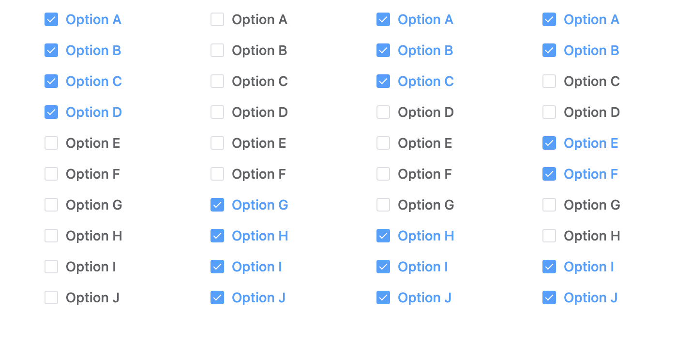

这大概是几个月之前的事情了，原本没打算记下来，正好也一直没有什么时间。不过类似的需求出现了不止一次，所以还是做简单的总结吧。

## 问题

事情是这样的，有一个checkbox 列表，可以勾选一部分，但是剩余未勾选的一定要连在一起，不可以断开。比如有10个checkbox，你可以勾选前面几个，也可以勾选后面几个，或者前后都勾选几个留下中间不勾选，但是不可以勾选中间部分，留两侧的不勾选。比如下图所示

如上四列，前三列都是可以的，最后一列由于未勾选的 CDGH被已勾选EF隔开导致不连续了，所以在勾选时不能出现这种情况，**产品需求是在勾选过程中就不可以出现这样的状况**。所以这样勾选列表在初始化的时候，应该只有一前一后是可以选的，中间全部禁用置灰。如下图

说到此处，不访先自行考虑一下有什么可行的方案

## 方案一

当同事拿这个需求来找我的时候，刚开始也是一脸懵B，以前确实也没遇到过这样需求。第一反应就是上图这样，**初始化一前一后可选，中间禁用，每勾选一个，那它的下一个就变成可选**，比如勾选 A后，启用 B, 勾选 B后，启用 C,  反过来也是一样勾选 E后启用 D,勾选 D后启用 C。貌似没什么问题，然而实操之后却发现，并没有想的到那么简单。在勾选 A,B 之后，此时 C 变成可选状态，与此同时还需要禁用 A,如下图

因为如果此时不禁用A，一旦你取消勾选 A,将会造成未勾选的 ACD不连续。**所以逻辑又要变成勾选一个，启用下一个，禁用前一个**。

然而并没有完，经过梳理发现当按照顺序勾选到E时，没有下一个要启用，上一个 D 也不应该禁用，而是应该启用所有的 checkbox，如下图

此时的状态是可以取消勾选任意一个，但是一旦取消勾选一个，它相邻的应该保持启用，其余的全部需要禁用，避免用户间隔取消，造成不连续状态。

如此梳理了一下之后，结果是**发疯**，这里面的判断逻辑真是千变万化，不知道要用多少的 if/else 才可以实现需求，等要实现了，估计黄花菜都凉了吧。

*面对这个需求，如果你的一直觉也是上面这个思路，那不访来实现一下看看*

## 方案二

在经历过越梳理分支越多，逻辑越乱，头越大的绝望之后，还是放弃了，也不知道猴年马月才能梳理通。

重新审视需求发现，**要的不过是未勾选的不能连续**。而勾选/取消勾选一个 checkbox 将造成一个新的状态，只要对这个新的状态进行校验是否符合要求，就知道刚刚的操作是否是可以的，如果新状态不符合要求，那刚刚的操作就应该是不被允许的，相对应checkbox 应该是禁用状态才对。如果新状态符合要求，那相应的 checkbox 应该保持为可操作状态。

稍微整理一下，把列表当前状态看成是一个数组比如`[1,0,0,0,0]`，表示第一个勾选，后面4个未勾选，这个状态自然是符合要求的。在这个状态下需要计算出每一个 checkbox 是否可操作，是否需要禁用。判断第一个 checkbox 的逻辑就应该是检测 `[0,0,0,0,0]`这个新状态是否符合要求，结果自然是符合要求，那第一个checkbox就是可操作，不需要禁用。第二个就需要判断`[1,1,0,0,0]`这个状态，第三个则需要判断`[1,0,1,0,0]`这个状态。以此类推，最后一个 checkbox 就需要判断 `[1,0,0,0,1]` 这个状态。最后会得到每个 checkbox 的结果如 `[0,0,1,1,0]` , 表示每1，2，5个 checkbox 可以操作，而第3，4个 checkbox是不能操作，应该禁用

### 校验状态

针对任意一个状态校验是否符合要求的方式那就太多，具体的代码就不展示了，可选方案有两种，

第一种方案是对状态数组从前往后进行一次遍历，先找到第一个0（第一个未勾选），找到后开始找1（连续未勾选结束），找到后再找0（产生了不连续的勾选）

第二种方案是对状态数组进行一次 filter + map操作，过滤出所有0并记录其在状态数组中的位置。比如`[1,0,0,0,0]`这个状态数组筛选结果就是[1,2,3,4]，然后使用最后一个0的位置减第一个0的位置加1看是否和结果数组的长度（也就是0的个数）进行对比

## 方案三

如果你有其它实现思路，或者对校验状态的逻辑有什么想法，欢迎留言讨论

